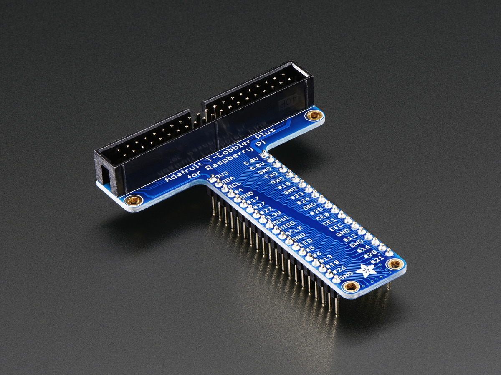
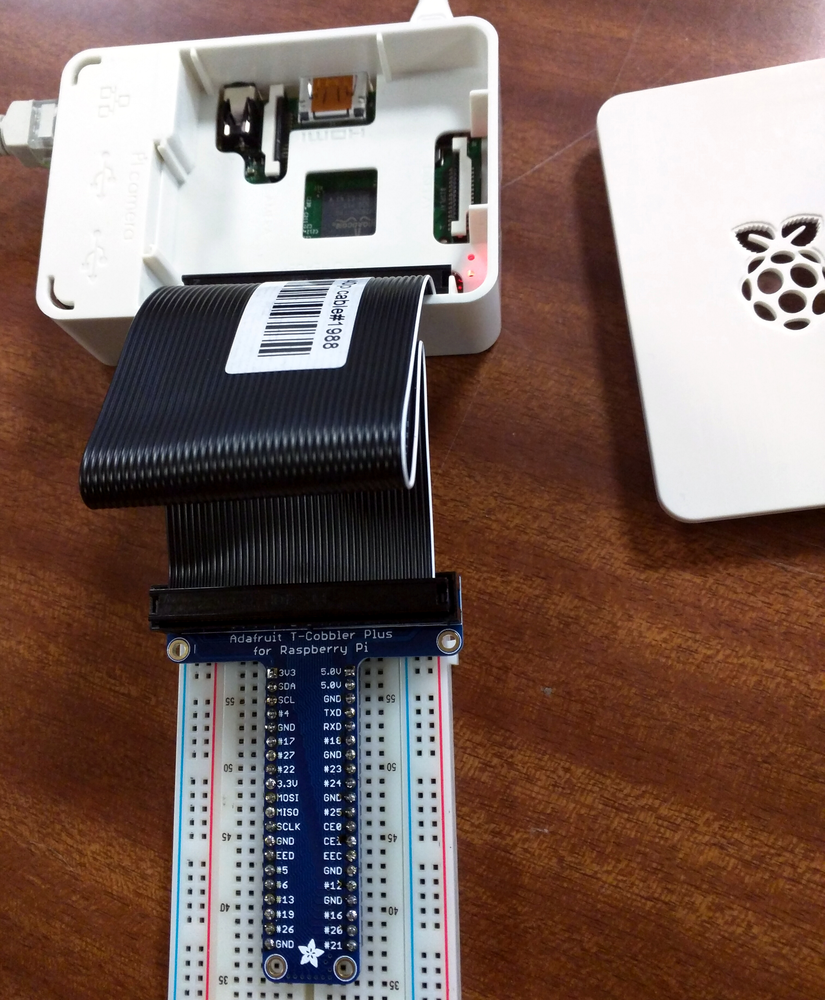
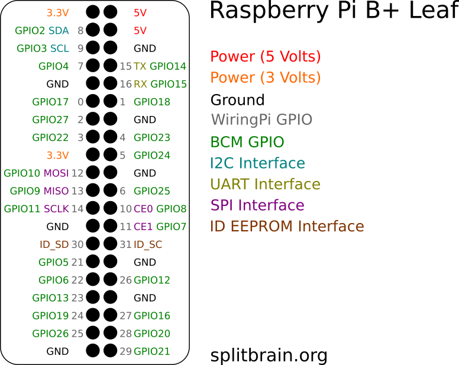
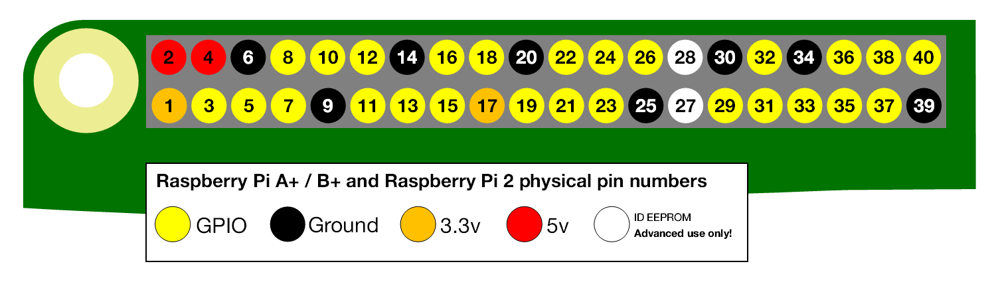
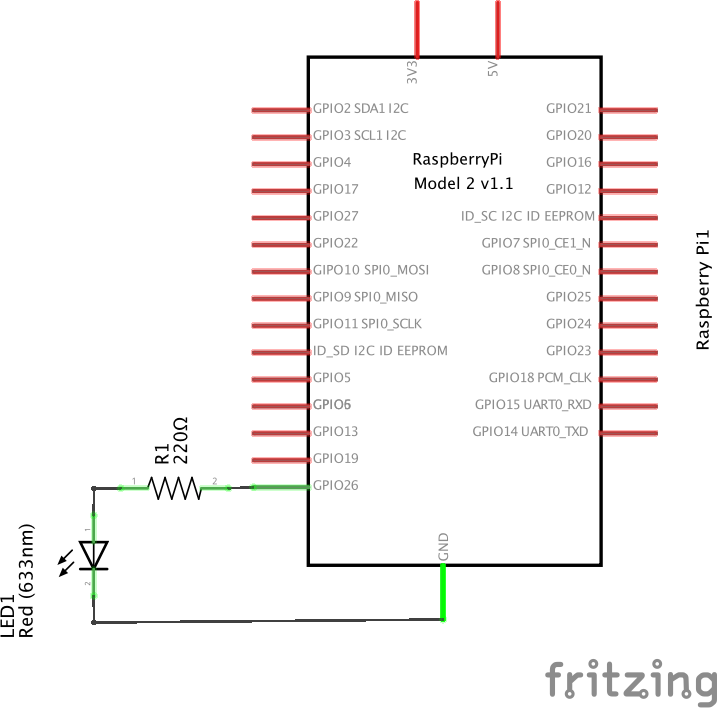
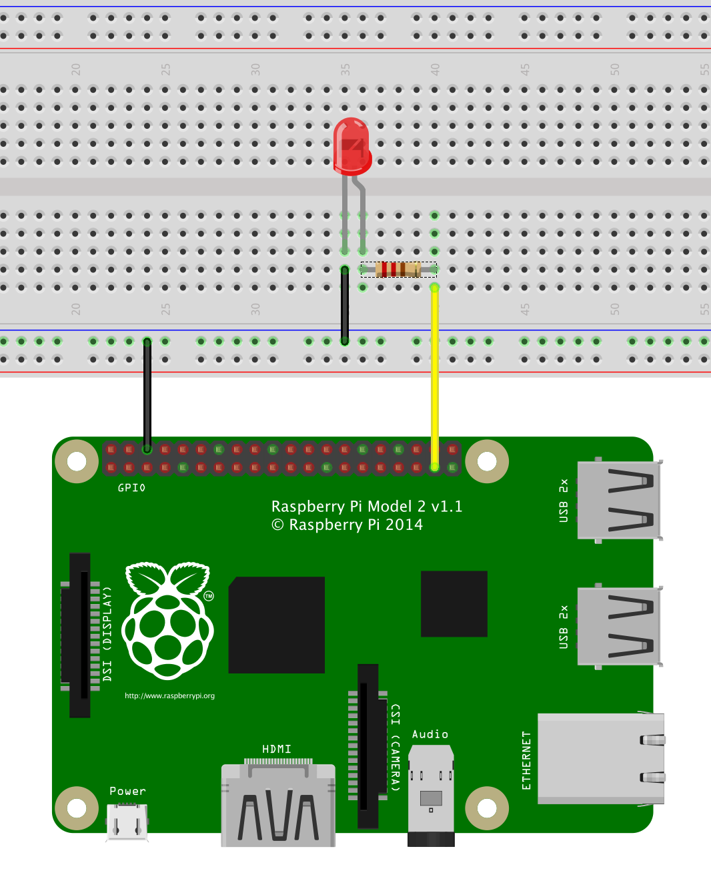
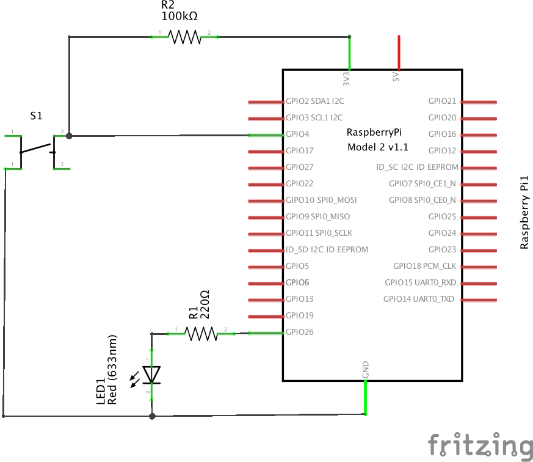
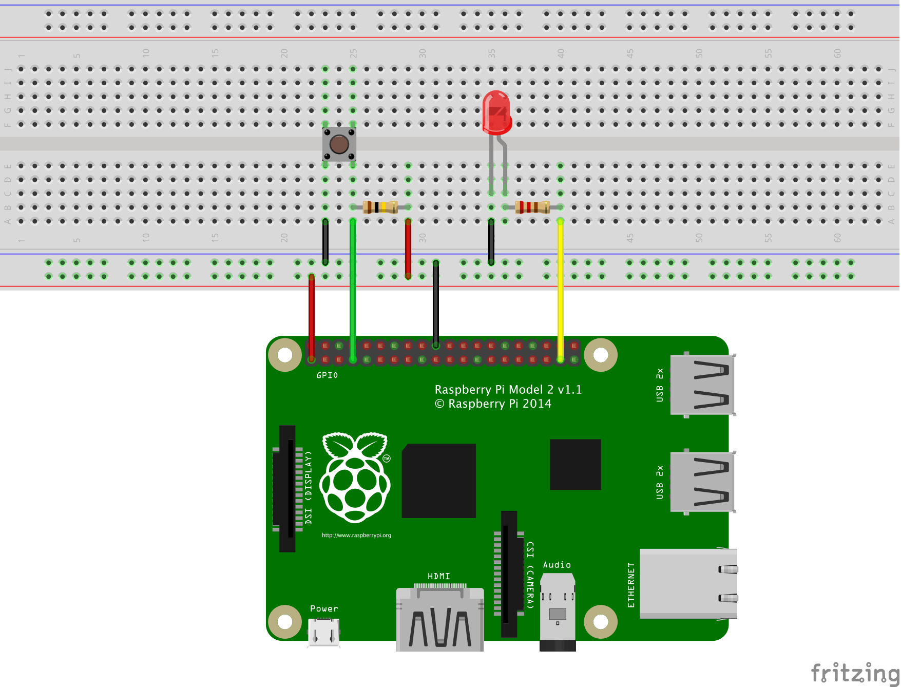
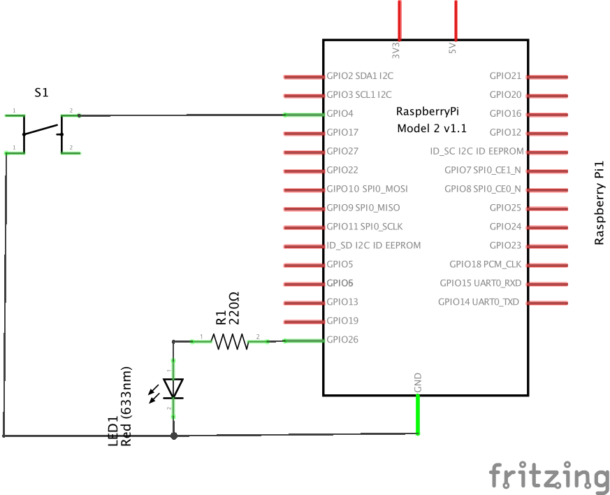
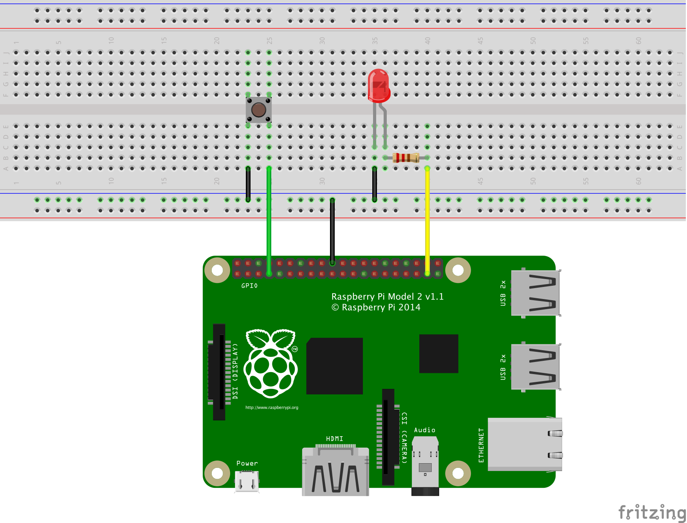

Présentation et objectifs
-------------------------

Après avoir [configuré votre Raspberry Pi](Installation_de_Raspbian "wikilink"), l'intention de cet atelier est de vous faire découvrir la programmation en Python. En plus de la découverte du langage de programmation, l'atelier montrera comment interagir avec des composants électroniques simples (LED, Interrupteurs, ...) à travers le port d'extension du Pi (GPIO).

Deux bibliothèques Python d'accès au GPIO seront explorées :

-   [RPi.GPIO](https://pypi.python.org/pypi/RPi.GPIO)
-   [GPIO Zero](http://pythonhosted.org/gpiozero/)

La première est celle que l'on retrouve dans la majorité des exemples sur le web. La seconde plus récente, propose un accès plus simple au GPIO pour une personne peu habituée à la programmation.

Pré-requis
----------
Avant de pouvoir réaliser cet atelier, il faut disposer d'un [Raspberry Pi configuré](Installation_de_Raspbian "wikilink"). Pour faciliter le développement, l'[IDE Web d'Adafruit](https://learn.adafruit.com/webide/overview) est une option intéréssante. Il permet d'écrire et de lancer des scripts Python directement à partir d'un navigateur Web.

### Matériel

Décrivez le matériel nécessaire :

- Un raspberry Pi 2 ou B+
- Une breadboard
- Des strips
- Des LED de couleur
- Des résistances de 220 Ohms
- Des boutons poussoirs
- Un Pi cobbler (Optionnel)

L'utilisation du Pi cobbler permet de s'éviter bien des difficultés en facilitant grandement le câblage sur une breadboard. 
Chaque entrée/sortie y est repéré par une inscription lisible. 






Si vous n'avez pas de Cobbler, vous pouvez utiliser le [Raspberry Pi B+ Leaf](http://www.splitbrain.org/blog/2015-03/29-raspberry_pi_bplus_pinout_leaf) qu'il vous suffira d'imprimer, de découper à la bonne taille et de percer.



### Première étape : découverte du GPIO
En plus d'être un nano-ordinateur multi-usage et généraliste, le Raspberry Pi dispose d'un ensemble d'éntrées/sorties 
qui permettent d'interagir avec des montages électroniques. Cet ensemble de 40 broches est appelé GPIO (General Purpose Input / Output) et il 
est situé sur l'arrête supérieure de la carte (quand les inscriptions sur la cartes sont dans le sens de la lecture). Au fil des version du Raspberry Pi, 
ce port d'extension a évolué et dans cet atelier, nous considérons que la dernière version présente sur les modèles B+ et 2.


Ces broches sont une interface physique entre le Pi et le monde extérieur. Au niveau le plus simple, vous pouvez les considérer comme des commutateurs que 
l'on peut activer ou désactiver (entrée) ou que le Pi peut activer ou désactiver (sortie). Sur les 40 broches, 26 sont des broches GPIO et les autres sont 
des alimentations (3.3V ou 5V) ou des masses (0V).


Il faut remarquer que la numérotation des broches semble peu naturelle au premier abord. Cela vient du fait que les numéros des broches correspondent au numéro des sorties du microcontrolleur Broadcom au coeur de la carte. Pour un être humain ça ne correspond à rien de parlant et généralement on a pas d'autres choix que de se référer à un guide.

Il existe une autre façon de numéroter les broches, qui est moins utilisée, c'est la numérotation physique. Dans cette numérotation, la broche en bas à gauche est la numéro 1, celle du dessus la numéro 2, etc...



### Deuxième étape : préparation du Pi
Le Raspberry PI se programme en Python. Python est un langage de programmation interprété à la fois simple mais aussi extrêmement puissant. Le système d'exploitation Raspbian (dérivé de Debian) & Occidentalis (Raspbian améliorée à l'AdaFruit) disposent déjà tout deux d'un environnement de programmation Python.

Cependant, pour pouvoir exploiter pleinement le port GPIO de votre Raspberry, vous aurez besoin de de faire quelques mise-à-jours. La mise-à-jour et l'ajout de nouveaux paquets se fait à l'aide d'un terminal.

#### Ouverture d'un terminal

Un terminal est une session de type texte qui permet d'entrer des commandes au clavier. Le plus simple pour paramétrer votre raspberry pi est d'ouvrir un terminal à distance avec le logiciel SSH.

SSH est un procédé qui permet de prendre le contrôle d'un Raspberry PI en ligne de commande depuis un autre ordinateur. Cela vous permet de profiter du confort d'un PC pour faire des recherches internet et appliquer les solutions sur votre Raspberry. Par défaut, SSH est actif sur les OS Raspbian, il suffit de se connecter sur l'adresse IP de votre Raspberry en n'oubliant pas de mentionner l'utilisateur **pi**.

Sur votre Raspberry, vous pouvez obtenir l'adresse IP en saisissant la commande **ifconfig**. Une adresse IP ressemble à quelque chose comme 192.168.1.17.
 
Pour démarrer une session SSH, vous utiliser un logiciel comme Putty sous Windows. Si vous utilisez un système Linux (comme Ubuntu), il suffit de saisir la 
commande suivante (avec la bonne adresse IP) : 

`ssh pi@192.168.1.17`

#### Mise à jour Raspbian

Avant n'importe quel autre mise-à-jour ou installation de logiciel, **vous devez toujours vous assurer que votre système d'exploitation est à jour**

Entrez les commandes suivantes pour mettre votre Raspbian à jour:

`sudo apt-get update`
`sudo apt-get upgrade`
`sudo apt-get dist-upgrade`

#### Mise à jour de Python

Raspberry PI dispose déjà de Python mais pour faire du bricodage électronique, il faut installer quelques paquet et librairies python complémentaires :

`sudo apt-get install python-dev python3-dev`
`sudo apt-get install python-pip python3-pip`

#### Ajout des bibliothèques

Le package **python-pip** installe un utilitaire nommé PIP, ce dernier permet d'installer des librairie python plus facilement.

A titre d'exemple (et librairie utilisé par un Tutoriel AdaFruit), nous allons installer la librairie **feedparser** pour python.

`sudo pip install feedparser`

Il existe actuellement deux branches de Python qui coexistent. La première, la plus ancienne, la branche 2.x, elle constitue l'évolution du langage restant compatible avec l'existant. La seconde, la branche 3.x, est une évolution du langage visant à le rendre plus cohérent et à gommer certaines hésitations du passé. Même si globalement l'essentiel du langage n'a pas changé, cette nouvelle version casse la compatibilité avec la version 2.x. Du point de vu d'un nouveau développeur Python, il vaut mieux partir directement sur la branche 3.x (car à terme il n'y aura plus qu'elle) mais il faut savoir qu'encore beaucoup d'exemples du Web sont écrits pour la branche 2.x.

Pour installer la même bibliothèque pour Python 3, il faut utiliser la commande **pip-3.2** : 

`sudo pip-3.2 install feedparser`

#### Installation de la console interactive IPython
IPython est un terminal interactif, ou shell, pour le langage de programmation Python qui propose des fonctionnalités telles que l'introspection, une syntaxe additionnelle, la complétion et un historique riche. Il permettra de lancer les premières commandes Python avant d'être capable d'écrire vos propres scripts. Il permet aussi de plus facilement tester des fonctionnalités du langage et des bibliothèques associées.

L'installation se passe comme pour les autres paquets  : 

`sudo apt-get install ipython3 ipython`

Pour lancer **ipython** rien de plus simple : 
```sh
pi@nedsebpi ~ $ ipython3
Python 3.2.3 (default, Mar  1 2013, 11:53:50)
Type "copyright", "credits" or "license" for more information.

IPython 0.13.1 -- An enhanced Interactive Python.
?         -> Introduction and overview of IPython's features.
%quickref -> Quick reference.
help      -> Python's own help system.
object?   -> Details about 'object', use 'object??' for extra details.

In [1]:
```

Pour lancer une commande Python, il suffit de l'écrire sur l'invite de commande et de valider en appuyant sur la touche *entrée* :

```sh
In [1]: print("hello world")
hello world

In [2]:
```

Si on veut avoir la documentation en ligne d'une fonction ou d'une classe, il suffit d'écrire son nom dans l'invite de commande suivi d'un point d'interrogation : 
```sh
In [2]: print?
Type:       builtin_function_or_method
String Form:<built-in function print>
Namespace:  Python builtin
Docstring:
print(value, ..., sep=' ', end='\n', file=sys.stdout)

Prints the values to a stream, or to sys.stdout by default.
Optional keyword arguments:
file: a file-like object (stream); defaults to the current sys.stdout.
sep:  string inserted between values, default a space.
end:  string appended after the last value, default a newline.

In [3]:
```

Cette fonctionnalité est particulièrement intéressante quand ou découvre le langage car elle permet d'avancer progressivement 
sans devoir lire une documentation exhaustive et indigeste.  
 
#### Support GPIO pour Python

Finalement, nous allons ajouter les bibliothèques de support du GPIO pour Python. Cela permettra de commander les broches du port GPIO directement à partir d'un script Python :-)

`sudo pip install RPi.GPIO gpiozero`

`sudo pip-3.2 install RPi.GPIO gpiozero`

Ressource: [Prepare Python](http://learn.adafruit.com/raspberry-pi-e-mail-notifier-using-leds/prepare-python) d'AdaFruit.

Pour vérifier que la bibliothèque est bien disponible dans l'interpréteur, vous pouvez essayer de charger la bibliothèque avec la directive **import** : 

```sh
In [3]: import RPi.GPIO

In [4]: import gpiozero

```
Si aucun message d'erreur n'apparait c'est que tout s'est bien passé et que les bibliothèques sont correctement installées.

#### Installation de l'IDE Web Adafruit
Il existe de nombreuses solutions pour lancer du code Python sur un Raspberry Pi. La plus simple (pour un technicien) est de le faire directement dans un terminal. Pour ceux qui ont branché leur Pi à un écran, il existe un IDE simpliste qui s'appelle IDLE. Pour les plus experts, vous pouvez utiliser un IDE comme PyCharm en mode "remote". 

Quand on est débutant, toutes ces solutions ne sont pas nécessairement évidente à prendre en main car elles introduisent un degré supplémentaire de complexité qui peut freiner l'apprentissage. La solution proposée ici, l'IDE Web d'Adafruit, est un peu plus complexe à mettre en oeuvre mais une fois en place, l'écriture de programmes en Python peut se faire sans entrave en ouvrant simplement un navigateur Web.

Pour l'installer, il n'y a qu'une simple commande à taper dans votre console SSH :

`curl https://raw.githubusercontent.com/adafruit/Adafruit-WebIDE/alpha/scripts/install.sh | sudo sh`

Une fois l'installation terminée, vous devriez avoir les lignes suivantes : 
```
**** Starting the server...(please wait) ****
**** The Adafruit WebIDE is installed and running! ****
**** Commands: sudo service adafruit-webide.sh {start,stop,restart} ****
**** Navigate to http://nedsebpi.local to use the WebIDE
```

L'ensemble du code écrit dans l'IDE Web est sauvegardé directement sur un dépot BitBucket, il faudra donc disposer d'un compte pour pouvoir utiliser l'IDE. Les étapes à suivre sont documentées sur la page suivante : https://learn.adafruit.com/webide/getting-started

Ressources : [Adafruit Web IDE](https://learn.adafruit.com/webide)

### Troisième étape : LED clignotante
Le premier montage que l'on va effectuer est un grand classique de l'électronique numérique : la LED clignotante.

Évidement utiliser un nano-ordinateur pour juste faire clignoter une LED est largement disproportionné mais cet exemple a de nombreuses qualités pédagogiques. Tout 
d'abord, il est simple à réaliser et simple à comprendre. Aucune notion complexe d'électronique n'est mise en jeu. Il faut juste comprendre que quand la broche est à l'état haut, la LED sera éclairée et quand la broche est à l'état bas, la LED est éteinte. Le fait d'utiliser un composant lumineux permet de comprendre visuellement ce que fait notre programme ce qui facilite la compréhension pour un débutant. 

Pour commander la LED, on utilisera la broche numéro 26 et la masse située juste à proximité. Pour limiter le courant, on utilise une résistance de 220 Ohms.
Voici le schéma de principe du montage :



La réalisation de ce schéma sur une breadboard devrait ressembler à cela :



Dans le fichier `blink_RPi.py` écrire le code suivant : 
```python
#!/usr/bin/env python

import RPi.GPIO as GPIO
import time

def blink(pin, n=50):
    GPIO.setmode(GPIO.BCM)
	GPIO.setup(pin, GPIO.OUT)
	for i in xrange(n):
	    GPIO.output(pin, GPIO.HIGH)
		time.sleep(1)
		GPIO.output(pin, GPIO.LOW)
		time.sleep(1)

if __name__ == "__main__":
    blink(26)
```

Pour lancer votre programme lancer la commande suivante :
`python3 blink_RPi.py`


Pour commencer à lire ce programme, il faut regarder tout d'abord les deux dernières lignes :
```python
if __name__ == "__main__"
    blink(26)
```
La première est une instruction conditionnelle qui permet à l'intérpreteur Python de ne lancer le code qui suit que si le script est appelé directement à partir de la ligne de commande. La ligne suivante est un appel de la fonction **blink** en lui passant le numéro de broche sur lequel on a connecté notre LED. Ces deux lignes constitue donc la fonction principale de notre script.

La deuxième partie intéressante de notre programme est la définition de la fonction **blink**. 
Voici le détail de chaque instruction : 

 - `GPIO.setmode(GPIO.BCM)` permet de préciser à la bibliothèque que le programme utilisera la numérotation standard des broches. 
 - `GPIO.setup(pin, GPIO.OUT)` configure la broche numéro **pin** en sortie.
 - `for i in xrange(n):` permet de répéter **n** fois la séquence d'instruction indentée.
 - `GPIO.output(pin, GPIO.HIGH)` met la broche **pin** à l'état haut (tension de 3V3). Dans notre cas ça allumerait la LED connecté sur la broche numéro **pin**.
 - `time.sleep(1)` attend une seconde.
 - `GPIO.output(pin, GPIO.LOW)` met la broche **pin** à l'état bas (tension de 0V). Dans notre cas ça éteindrait la LED.

Cette fonction permet donc de faire clignoter **n** fois la LED connectée sur la broche **pin**.


Comme indiqué en préambule, depuis peu, il existe une seconde bibliothèque d'accès au GPIO. Elle se base sur des concepts plus haut niveau. La plupart des composants de base sont directement modélisé au lieu de se référer qu'à des concepts électroniques.


Dans le fichier `blink_gpiozero.py` écrire le code suivant : 
```python
#!/usr/bin/env python
from gpiozero import LED
from time import sleep

def blink(pin, n=50):
    led = LED(pin)
    for i in xrange(n):
        led.on()
        sleep(1)
        led.off()
        sleep(1)

if __name__ == "__main__":
    blink(26)
```

Pour lancer votre programme lancer la commande suivante :
`python3 blink_gpiozero.py`

Le programme est finalement assez similaire au précédent mais on remarque qu'il est moins verbeux et plus expressif.

### Variantes
Pour vous entrainer à utiliser les concepts des exemples précédents, essayez de réaliser les montages et les programmes suivants : 
- Le [chenillard de K2000](http://www.dailymotion.com/video/x5mruq_k2000_auto).
- Le feu tricolore.
- L'afficheur sept segments.

### Troisième étape : Bouton poussoir
Le second montage va être une complexification du montage précédent en rajoutant un bouton poussoir. Un bouton poussoir est un interrupteur normalement ouvert qui n'est activé que quand on reste appuyé dessus. Même si d'un point vu électronique, ça reste un composant très simple, sa mise en oeuvre demande quelques connaissances supplémentaires.



La réalisation de ce schéma sur une breadboard devrait ressembler à cela :



Quand on regarde le montage, on remarque qu'un coté de l'interrupteur est relié à la masse et que l'autre est relié à une entrée du Raspberry Pi. Il y a aussi une resistance qui est reliée à VCC. Cette résistance permet de fixer l'état de l'entrée à l'état haut quand le bouton poussoir est non-activé. Quand on presse sur l'interrupteur, l'entrée se retrouve au potentiel de la masse (c'est à dire à l'état bas). Cette résistance qui "tire" l'entrée vers le haut s'appelle une resistance de pull-up.

Comme l'utilisation de ces résistances est extrêmement courant, les microcontroleurs offrent la possibilité d'en utiliser sans rajouter de composants. Ces résistance de pull-up sont actionnables programmatiquement. Le montage est donc simplifié : 



La réalisation de ce schéma sur une breadboard devrait ressembler à cela :



Dans le fichier `push_RPi.py` écrire le code suivant : 

```python
#!/usr/bin/env python

import RPi.GPIO as GPIO
import time

GPIO.setmode(GPIO.BCM)
GPIO.setup(26, GPIO.OUT, initial=GPIO.LOW)
GPIO.setup(4, GPIO.IN, pull_up_down=GPIO.PUD_UP)

# Si on detecte un appui sur le bouton, on allume la LED 
# et on attend que le bouton soit relache
if __name__ == "__main__":
	while True:
	    state = GPIO.input(4)
	    if not state:
	        # on a appuye sur le bouton connecte sur la broche 4
	        GPIO.output(26, GPIO.HIGH)
	        while not state:
	            state = GPIO.input(4)
	            time.sleep(0.02) # Pause pour ne pas saturer le processeur
	        GPIO.output(26, GPIO.LOW)
	    time.sleep(0.02)  # Pause pour ne pas saturer le processeur
```

Dans le fichier `push_gpiozero.py` écrire le code suivant : 

```python
#!/usr/bin/env python
from gpiozero import LED, Button
from time import sleep

led = LED(26)
button = Button(4)

if __name__ == "__main__":
	while True:
	    button.when_pressed = led.on
	    button.when_released = led.off
```


[Catégorie:Formations](Catégorie:Formations "wikilink") [Catégorie:Raspberry\_Pi](Catégorie:Raspberry_Pi "wikilink")
