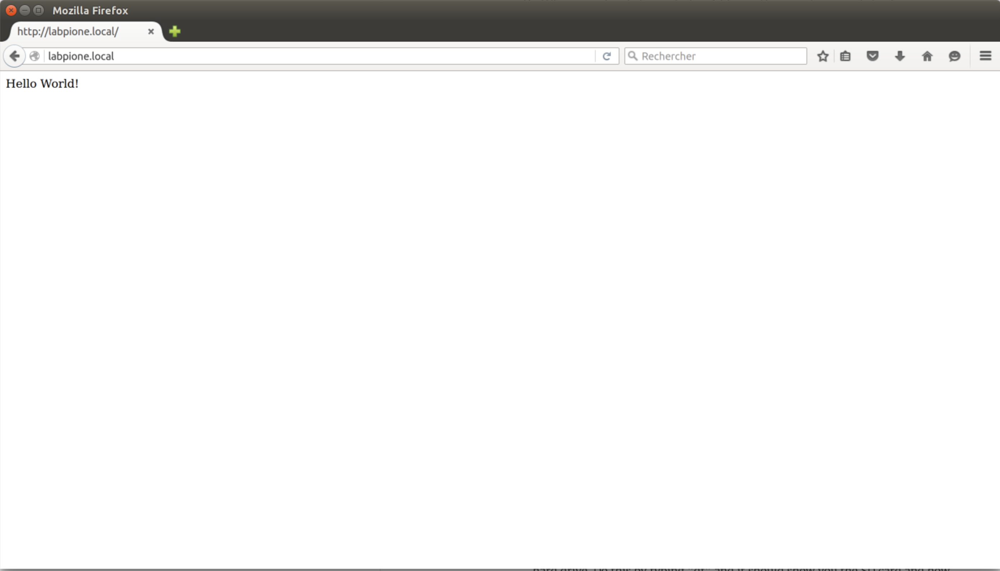

Présentation et objectifs
-------------------------

Après avoir [configuré votre Raspberry Pi](Installation_de_Raspbian "wikilink"), l'intention de cet atelier est de continuer à vous faire découvrir la programmation en Python. En plus de continuer à pratiquer ce langage, cet atelier fera découvrir Flask pour développer rapidement une application Web en Python.

Flask est un framework open-source de développement web en Python. Son but principal est d'être léger, afin de garder la souplesse de la programmation Python, associé à un système de templates. Bien que facile à prendre en main, ce framework offre de vastes possibilités. Son système d'extension permet de trouver des modules pour tous les usages classiques (Formulaires, Authentification, Base de données, système de cache, ... ). 

Dans le premier atelier, nous avions vu à quel point il était simple d'utiliser le Raspberry Pi pour obtenir des données à partir de serveurs via Internet.  Votre Pi peut aussi agir comme un serveur lui-même. Il y a beaucoup de serveurs web que vous pouvez installer sur le Raspberry Pi. Les serveurs web traditionnels, comme Apache ou lighttpd, servent les fichiers à vos clients. La plupart du temps, ils envoient des fichiers HTML et des images, mais ils peuvent également servir du son, de la vidéo, et des programmes exécutables, et bien plus encore.

Cependant, il y a une nouvelle sorte d'outils qui étendent les langages de programmation comme Python, Ruby et JavaScript pour créer des serveurs Web qui génèrent dynamiquement du HTML quand ils reçoivent les requêtes HTTP à partir d'un navigateur Web. Ceci est une excellente façon de déclencher des événements physiques, de stocker des données, ou vérifier la valeur d'un capteur à distance via un navigateur Web. Vous pouvez même créer votre propre API JSON, MQTT pour un de vos projets domotique ;) 


Pré-requis
----------
Avant de pouvoir réaliser cet atelier, il faut disposer d'un [Raspberry Pi configuré](Installation_de_Raspbian "wikilink"). Pour faciliter le développement, l'[IDE Web d'Adafruit](https://learn.adafruit.com/webide/overview) est une option intéressante. Il permet d'écrire et de lancer des scripts Python directement à partir d'un navigateur Web.

### Matériel

Décrivez le matériel nécessaire :

- Un raspberry Pi 2 ou B+
- Une breadboard
- Des fils d'interconnexion
- Des LED de couleur
- Des résistances de 220 Ohms
- Des boutons poussoirs
- Un Pi Sense Hat (Optionnel)

Pour enrichir ce tutoriel avec plusieurs capteurs, nous utiliserons une carte fille développée pour le projet [Astro Pi](https://astro-pi.org/). Ce "Hat" comporte plusieurs capteurs I2C :  
- Accéléromètre
- Gyromètre
- Magnétomètre
- Température
- Pression
- Humidité

En plus de ces capteurs environnementaux (utiles pour la mission spatiale pour laquelle la carte a été prévue), il y a aussi un joystick et une matrice de led RGB 8x8. Ce hat peut donc être utilisé aussi pour faire découvrir de manière créative le développement de jeux vidéo.


L'installation Pi Sense Hat se résume à l'activation de l'I2C dans `raspi-config` et à l'installation de deux bibliothèques Python :
```sh
sudo apt-get install sense-hat
sudo pip install pillow
sudo pip3 install pillow
``` 

Pour vérifier le bon fonctionnement de la carte, vous pouvez lancer le script suivant : 
```python
from sense_hat import SenseHat
 
sense = SenseHat()
sense.clear()
 
temp = sense.get_temperature()
print(temp)
```

Ce programme affiche simplement la température sur le terminal. Si vous voulez afficher cette information sur l'écran à LED, vous pouvez utiliser le script suivant : 

```python
from sense_hat import SenseHat
 
sense = SenseHat()
sense.clear()
 
tmax = 35
tmin = tmax - 8
 
while True:
    temp = sense.get_temperature()
    print(temp)
    temp = int(temp) - tmin
    for x in range(0, 8):
        for y in range(0, temp):
            sense.set_pixel(x, y, 255, 0, 0)
        for y in range(temp, 8):
            sense.set_pixel(x, y, 0, 0, 0) 
```

### Première étape : découverte de Flask
Flask va transformer votre Raspberry Pi en un serveur Web dynamique. Bien qu'il y ait beaucoup de choses possibles avec Flask, il prend également en charge de nombreuses extensions. 
Vous avez également accès à l'ensembles des bibliothèques Python qui pourront être utile pour accélérer le développement de votre application.

Pour installer Flask, rien de plus simple : 
```sh
sudo pip install flask
sudo pip3 install flask
``` 
#### Première application web

Pour vérifier l'installation, dans le fichier `helloflask.py`, écrire le programme suivant :
```python
from flask import Flask
app = Flask(__name__)

@app.route("/")
def hello():
    return "Hello World!"

if __name__ == "__main__":
    app.run(host='0.0.0.0', port=80, debug=True)
```

Avant de lancer ce script, regardons ligne à ligne son fonctionnement.

```python
from flask import Flask
```
Cette ligne charge la classe `Flask` à partir de la bibliothèque `flask`. 

```python
app = Flask(__name__)
```
Cette instruction crée un objet du type `Flask` à partir duquel notre application pourra interagir avec le framework.

```python
@app.route("/")
    def hello():
```
Cette séquence indique au framework qu'à chaque fois qu'un client accède à la page principale (celle dont l'URL relative est "/"), il faudra appeler la fonction `hello()` pour construire la réponse à retourner.

```python
return "Hello World!"
```
Retourne le contenue de la page qui sera affiché dans le navigateur web du client.


```python
if __name__ == "__main__":
```
Indique que le code associé peut être directement lancé à partir de la ligne de commande.

```python
app.run(host='0.0.0.0', port=80, debug=True)
```
Lance l'application sur toutes les interfaces réseaux du Pi. Le port utilisé est le 80, ce qui évite de devoir le préciser dans l'URL. Cela implique que votre programme devra être lancé en mode super utilisateur.

#### Démarrage du serveur Web

Lancez ce programme avec la commande suivante :
```
sudo python helloflask.py
```

Ouvrir un navigateur se rendre à l'adresse `http://raspberrypi.local` (changer `raspberrypi` pour votre nom d'hôte).




Dans votre terminal, vous devriez voir ceci : 
```sh
pi@labpione:~ $ sudo python helloflask.py 
 * Running on http://0.0.0.0:80/ (Press CTRL+C to quit)
 * Restarting with stat
 * Debugger is active!
 * Debugger pin code: 228-604-282
192.168.148.53 - - [20/Jan/2016 10:53:00] "GET / HTTP/1.1" 200 -
192.168.148.53 - - [20/Jan/2016 10:53:00] "GET /favicon.ico HTTP/1.1" 404 -
```
L'avant dernière ligne indique le navigateur a demandé la page "/" et que le serveur a retourné une réponse correcte (code retour HTTP 200). La ligne suivante indique que le navigateur a demandé le fichier `favicon.ico` mais que celui-ci n'existe pas (code retour HTTP 404).

Avec ce script nous avons déjà mis en place tout ce qui est nécessaire pour répondre à des requêtes HTTP. Généralement, si le client HTTP est un navigateur, la réponse attendue doit être un document HTML.

#### Création de templates
L'écriture d'un document HTML est une activité qui a peu de rapport avec la programmation. Dans le monde du Web, il est plus qu'admis que mélanger du code applicatif avec des éléments de présentation est une mauvaise pratique. 

Pour effectuer la séparation entre fond et forme, le framework Flask s'intègre avec le moteur de template Jinja2. Cela permettra de préparer des modèles de documents HTML que l'on pourra instancier à partir des données présentes dans le code.

Avec votre éditeur de texte habituel, créez le fichier `hellotemplate.py` avec le contenu suivant : 

```python
# This Python file uses the following encoding: utf-8
from flask import Flask, render_template
import datetime
from sense_hat import SenseHat

sense = SenseHat()
sense.clear()

app = Flask(__name__)

@app.route("/")
def hello():
   temperature = sense.get_temperature()
   templateData = {
      'titre' : 'Bonjour Temperature!',
      'temperature':'%.2f'%temperature
      }
   return render_template('main.html', **templateData)

if __name__ == "__main__":
   app.run(host='0.0.0.0', port=80, debug=True)
```

Dans le même dossier que le fichier `hellotemplate.py` créez un dossier appelé `templates`. Dans ce répertoire, créez un fichier `main.html`.

```html
<html>
   <head>
      <title>{{ titre }}</title>
      <meta http-equiv="refresh" content="5">
   </head>

   <body>
      <h1>Bonjour!</h1>
      <h2>La température du pi est {{ temperature }}</h2>
   </body>
</html>
```

Comme on peut le voir, la seule différence avec le premier programme est l'utilisation de `render_template`. Cette fonction prend deux arguments, le premier est le nom du fichier modèle HTML et le second est un dictionnaire possédant une valeur pour chacune des variables du template. Cette fonction renvoie une chaîne de caractère contenant le document HTML retourné au navigateur du client. 

#### Connexion avec le reste du monde
Une application Flask n'étant rien d'autre qu'un script python classique, tous les outils du langages sont accessibles directement. Par exemple, les bibliothèques d'accès au GPIO peuvent être utilisée pour lire/écrire des valeurs sur une entrée/sortie. Dans les exemples ci-dessous, nous allons montrer comment coupler les templates avec les GPIO.

Le programme ci-après est une évolution du programme précédent auquel on rajoute la possibilité de lire les valeurs des broches du GPIO. 

Dans le fichier `hellogpio.py` placer le contenu suivant : 

```python
from flask import Flask, render_template
import datetime
import RPi.GPIO as GPIO
from sense_hat import SenseHat

sense = SenseHat()
sense.clear()

GPIO.setmode(GPIO.BCM)

app = Flask(__name__)

@app.route("/")
def hello():
   temperature = sense.get_temperature()
   templateData = {
      'titre' : 'Bonjour Temperature!',
      'temperature':'%.2f'%temperature
      }
   return render_template('main.html', **templateData)

@app.route("/readPin/<pin>")
def readPin(pin):
   try:
      GPIO.setup(int(pin), GPIO.IN)
      if GPIO.input(int(pin)) == True:
         response = "Pin number " + pin + " est high!"
      else:
         response = "Pin number " + pin + " est low!"
   except:
      response = "Erreur de lecture du pin " + pin + "."

   templateData = {
      'title' : 'Status of Pin' + pin,
      'response' : response
      }

   return render_template('pin.html', **templateData)

if __name__ == "__main__":
   app.run(host='0.0.0.0', port=80, debug=True)
```

Créez le fichier modèle `pin.html` pour afficher les informations : 

```html
<html>
   <head>
      <title>{{ title }}</title>
   </head>

   <body>
      <h1>Pin Status</h1>
      <h2>{{ response }}</h2>
   </body>
</html>
```

Sur cet exemple la principale nouveauté est l'utilisation de routes paramétrées. Ces routes permettent au code de récupérer une partie de l'URL directement dans une variable. 
Dans notre cas, quand le client va récupérer la page `http://raspberrypi.local/readPin/24`, Flask va appeler la fonction `readPin` avec comme paramètre 24.

La création de ces routes paramétrées se fait avec l'instruction suivante : 
```python
@app.route("/readPin/<pin>") 
```

De manière symétrique, on pourrait écrire une nouvelle route permettant de changer la valeur d'une sortie à partir d'une requête HTTP.

#### Rajouter du style
Pour l'instant, l'application Web développée bien que fonctionnelle reste très sommaire en terme esthétique. Pour gérer ces aspects dans l'univers, on utilise des feuilles de style CSS. Pour rajouter une feuille de style à notre application, il faut rajouter le fichier dans le répertoire `static`. Une fois ajouté, on peut y faire référence directement dans les templates.

Pour éviter de devoir créer nos feuilles de style à partir de rien, une extension de flask permet d'utiliser le framework Twitter Bootstrap. Pour l'installer, taper les commandes suivantes :
```sh
sudo pip install flask-script
sudo pip install flask-bootstrap
```

Modifiez le fichier `hellogpio.py` comme suit : 

```python
from flask import Flask, render_template
from flask.ext.script import Manager
from flask.ext.bootstrap import Bootstrap

import RPi.GPIO as GPIO
from sense_hat import SenseHat

sense = SenseHat()
sense.clear()

GPIO.setmode(GPIO.BCM)

app = Flask(__name__)
manager = Manager(app)
bootstrap = Bootstrap(app)

@app.route("/")
def hello():
   temperature = sense.get_temperature()
   templateData = {
      'titre' : 'Bonjour Temperature!',
      'temperature':'%.2f'%temperature
      }
   return render_template('main.html', **templateData)

@app.route("/readPin/<pin>")
def readPin(pin):
   try:
      GPIO.setup(int(pin), GPIO.IN)
      if GPIO.input(int(pin)) == True:
         response = "Pin number " + pin + " est high!"
      else:
         response = "Pin number " + pin + " est low!"
   except:
      response = "Erreur de lecture du pin " + pin + "."

   templateData = {
      'title' : 'Status of Pin' + pin,
      'response' : response
      }

   return render_template('pin.html', **templateData)

if __name__ == "__main__":
   app.run(host='0.0.0.0', port=80, debug=True)
``` 
Dans le fichier `main.html` : 
```html


Flasky


<div class="navbar navbar-inverse" role="navigation">
    <div class="container">
        <div class="navbar-header">
            <button type="button" class="navbar-toggle" data-toggle="collapse" data-target=".navbar-collapse">
                <span class="sr-only">Toggle navigation</span>
                <span class="icon-bar"></span>
                <span class="icon-bar"></span>
                <span class="icon-bar"></span>
            </button>
            <a class="navbar-brand" href="/">Flasky</a>
        </div>
        <div class="navbar-collapse collapse">
            <ul class="nav navbar-nav">
                <li><a href="/">Home</a></li>
            </ul>
        </div>
    </div>
</div>



<div class="container">
    <div class="page-header">
        <h1>Hello, {{ name }}!</h1>
    </div>
</div>

```


