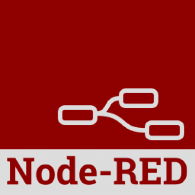
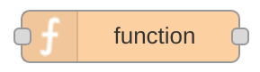

Présentation et objectifs
-------------------------

Après avoir [configuré votre Raspberry Pi](Installation_de_Raspbian "wikilink"), l'intention de cet atelier est de continuer à vous faire découvrir les possibilités de votre Raspberry Pi en utilisant [Node Red](http://nodered.org/). En plus de continuer à découvrir les possibilités de la carte, vous pourrez facilement interconnecter des objets connectés entre eux.

Node-Red permet de créer des workflows de données via une interface graphique Web. Par exemple, il est possible de demander que sur des informations venant des GPIO soient transmises à une API , un message MQTT soit transmis, un statut Twitter ... Node-Red dans sa forme la plus simple est un éditeur visuel à base de blocs que l'on "cable" entre eux. 

Qu'est-ce que cela veut dire? Cela signifie qu'il devient possible de passer plus de temps à faire "parler des choses" les unes avec les autres que de se préoccuper tout le code interfaçage. Le système contient des «nœuds» qui semblent simplement être icônes que vous faites glisser et déposer. Chaque nœud propose des fonctionnalités différentes. Par exemple, le nœud le plus simple est le noeud de débogage simple qui permet de voir ce qui se passe dans votre flux. Les nœuds "Raspberry Pi" vous permettent de lire et d' écrire les broches GPIO.


Cet outil a l'avantage d'être à la fois léger et simple à mettre en œuvre. Pour la majorité des scénarios, quasiment aucune compétence en programmation n'est nécessaire. De plus la communauté des utilisateurs développe de nombreux blocs permettant d'utiliser de plus en plus de services en ligne.

Dans la suite de ce tutoriel, nous commencerons par écrire des scénarios très simple pour comprendre les bases de l'utilisation de l'outil, puis nous terminerons par un scénario réaliste mettant en jeu plusieurs services différents. 


Pré-requis
----------
Avant de pouvoir réaliser cet atelier, il faut disposer d'un [Raspberry Pi configuré](Installation_de_Raspbian "wikilink") avec une version à jour de Raspbian.

### Matériel

Matériel nécessaire :
- Un raspberry Pi 2 ou B+
- Une breadboard
- Des fils d'interconnexion
- Des LED de couleur
- Des résistances de 220 Ohms
- Des boutons poussoirs
- Un Pi Sense Hat (Optionnel)

Pour enrichir ce tutoriel avec plusieurs capteurs, nous utiliserons une carte fille développée pour le projet [Astro Pi](https://astro-pi.org/). 

Ce "Hat" comporte plusieurs capteurs I2C :  
- Accéléromètre
- Gyromètre
- Magnétomètre
- Température
- Pression
- Humidité

En plus de ces capteurs environnementaux (utiles pour la mission spatiale pour laquelle la carte a été prévue), il y a aussi un joystick et une matrice de led RGB 8x8.


L'installation Pi Sense Hat se résume à l'activation de l'I2C dans `raspi-config` et à l'installation de deux bibliothèques Python :
```sh
sudo apt-get install sense-hat
sudo pip install pillow
sudo pip3 install pillow
``` 

Pour vérifier le bon fonctionnement de la carte, vous pouvez lancer le script suivant : 
```python
from sense_hat import SenseHat
 
sense = SenseHat()
sense.clear()
 
temp = sense.get_temperature()
print(temp)
```

Ce programme affiche simplement la température sur le terminal. Si vous voulez afficher cette information sur l'écran à LED, vous pouvez utiliser le script suivant : 

```python
from sense_hat import SenseHat
 
sense = SenseHat()
sense.clear()
 
tmax = 35
tmin = tmax - 8
 
while True:
    temp = sense.get_temperature()
    print(temp)
    temp = int(temp) - tmin
    for x in range(0, 8):
        for y in range(0, temp):
            sense.set_pixel(x, y, 255, 0, 0)
        for y in range(temp, 8):
            sense.set_pixel(x, y, 0, 0, 0)
```

### Première étape : installation de Node-Red

Il existe deux façons de commencer avec Node-Red sur un Raspberry Pi :

- utiliser la version présente dans les dépôts de la version Jessie de Raspbian.
- installer manuellement la version présente dans le référentiel `npm`.


#### Raspbian Jessie
À partir de Novembre 2015, dans Raspbian Jessie Node-Red est préinstallé sur l'image de la carte SD qui peut être téléchargé à partir du [site officiel](https://www.raspberrypi.org/downloads/raspbian/).
Si votre version de Jessie est antérieure à cette date, il vous suffit de mettre à jour vos dépots et d'installer le paquet : 

```sh
sudo apt-get update
sudo apt-get upgrade
sudo apt-get install nodejs nodejs-legacy nodered
```

##### Lancement de Node-Red

Pour démarrer Node-Red, vous pouvez soit :

- en mode graphique, sélectionner  `Menu -> Programmation -> Node-RED`.
- en mode console, exécuter `node-red-start`.

Dans votre console vous devriez avoir un affichage similaire à ceci :
```sh
$ node-red-start 

Start Node-RED
 
Once Node-RED has started, point a browser at http://192.168.1.91:1880
On Pi Node-RED works better with the Iceweasel browser
 
Use   node-red-stop                          to stop Node-RED
Use   node-red-start                         to start Node-RED again
Use   sudo systemctl enable nodered.service  to autostart Node-RED at every boot
Use   sudo systemctl disable nodered.service to disable autostart on boot
 
To find more nodes and example flows - go to http://flows.nodered.org
You may also need to install and upgrade npm
      sudo apt-get install npm
      sudo npm i -g npm@2.x
 
Starting Node-RED graphical event wiring tool....
Started Node-RED graphical event wiring tool..
Welcome to Node-RED
===================
1 May 18:00:22 - [info] Node-RED version: v0.13.4
1 May 18:00:22 - [info] Node.js  version: v0.10.29
1 May 18:00:22 - [info] Linux 4.1.14-v7+ arm LE
1 May 18:00:22 - [info] Loading palette nodes
pi : TTY=unknown ; PWD=/ ; USER=root ; COMMAND=/usr/bin/python -u /usr/lib/node_modules/node-red/nodes/core/hardware/nrgpio.py info
pam_unix(sudo:session): session opened for user root by (uid=0)
pam_unix(sudo:session): session closed for user root
1 May 18:00:30 - [info] Settings file  : /home/pi/.node-red/settings.js
1 May 18:00:30 - [info] User directory : /home/pi/.node-red
1 May 18:00:30 - [info] Flows file : /home/pi/.node-red/flows_labpione.json
1 May 18:00:30 - [info] Creating new flow file
1 May 18:00:30 - [info] Starting flows
1 May 18:00:30 - [info] Started flows
1 May 18:00:30 - [info] Server now running at http://127.0.0.1:1880/

```
La lecture de ce journal vous permet de connaître le port sur lequel est lancé votre serveur Node-Red. Dans l'exemple c'est le port 1880 qui est utilisé.


Pour arrêter votre instance Node-Red, il faudra exécuter la commande `node-red-stop`.

##### Lancement automatique à chaque démarrage
Si vous utilisez Node-Red dans un système personnel qui doit se faire oublier, l'idéal est de lancer automatiquement votre instance de 
Node-Red au démarrage du Raspberry Pi. Pour se faire, il suffit de lancer la commande suivante : 
```sh
sudo systemctl enable nodered.service 
```

##### Ajout de nouveaux noeuds

Pour ajouter des nouveaux noeuds dans votre installation Node-Red, le plus simple est d'utiliser l'outil d'installation de `node.js` appelé `npm`.
Les commandes suivantes installe cet outil et le configure pour utiliser la branche _2.x_.
```sh
sudo apt-get install npm
sudo npm install -g npm@2.x
cd ~/.node-red

```

Les différents blocs développé par la communauté est visible sur la page : [http://flows.nodered.org](http://flows.nodered.org). Pour installer l'un d'eux, 
il suffit de noter le nom du bloc et de l'installer avec les commandes suivantes :
```sh
cd ~/.node-red
npm install node-red-{example node name}
```
Une fois le bloc installé, il faut redémarrer le serveur Node-Red avec les commandes suivantes :
```sh
node-red-stop
node-red-start
```
#### Installation manuelle
Si vous souhaitez utiliser une autre version de `node.js` que celle présente dans les dépôts officiels de Raspbian Jessie, vous devrez installer manuellement Node-Red.
Cette procédure est bien plus complexe que la précédente et dépasse le cadre de ce tutoriel. La documentation officielle donne [la marche à suivre complète](http://nodered.org/docs/hardware/raspberrypi#manual-install).


### Deuxième étape : découverte de Node-Red

Une fois votre instance Node-Red en cours d' exécution, ouvrez un navigateur sur l'adresse suivante : 
http://{nom de votre Rasperry pi}.local:1880

Si tout se passe bien, vous devriez avoir l'affichage suivant : 


#### Ajouter un nœud Inject

Le nœud *Inject*, comme son nom l'indique, permet d'injecter des messages dans un flux, soit en cliquant sur le bouton sur le nœud, ou en fixant un intervalle de temps entre deux injections. Ce noeud produit des données, il est donc considéré comme une entrée. Il sera utilisé comme point d'entré d'un flot.


Pour l'utiliser dans le flot courant, faites glisser ce nœud sur l'espace de travail à partir de la palette à gauche. Ouvrir la barre latérale (Ctrl-Space, ou via le menu déroulant) et sélectionnez l'onglet Infos. Sélectionnez le nœud Inject nouvellement ajouté pour afficher des informations sur ses propriétés et une description de ce qu'il fait.


#### Ajouter un nœud Debug

Le nœud de débogage affiche dans la barre latérale de débogage les messages reçu à partir de son entrée. Par défaut, il affiche simplement la charge utile du message, mais il est possible d'afficher l'objet du message entier. Il consomme des données provenant d'autres noeuds, il est donc dans la catégorie des sorties.


Faites glisser ce nœud sur votre espace de travail pour l'ajouter. Comme pour le précédent, vous pouvez faire apparaître la fenêtre d'information pour avoir accès à la documentation du nœud.

#### Connecter les deux ensemble

Branchez les noeuds *Inject* et *Debug* ensemble en faisant glisser la souris entre le port de sortie premier et le port d'entrée du second.


#### Déployer

À ce stade, les nœuds existent uniquement dans l'éditeur et doivent être déployés sur le serveur. Cliquez simplement sur le bouton *Deploy* pour enregistrer votre flot courant et le lancer sur votre instance Node-Red. 

Sélectionnez l'onglet *Debug* de la barre latérale droite et cliquez sur le bouton Inject. Vous devriez voir les nombres apparaître dans la barre latérale. Par défaut, le nœud *Inject* retourne le nombre de millisecondes depuis le 1er Janvier, 1970 comme charge utile.


#### Ajouter un noeud de fonction

Le nœud de fonction permet de passer chaque message reçu à une fonction JavaScript. Ces nœuds sont extrêmement utiles pour transformer un message reçu et l'injecter dans d'autres noeuds.



Câblez le nœud de fonction entre les nœuds Inject et Debug. Vous devrez peut-être supprimer le fil existant (sélectionner et appuyez sur Suppr sur le clavier). 


Double-cliquez sur le nœud de fonction pour faire apparaître la boîte de dialogue d'édition. 


Copiez le code de suivi dans le domaine de la fonction:
```javascript
//Création d'un objet Date à partir de la charge utile 
var date = new Date(msg.payload);
//Transformation de la charge utile en une chaîne formatée 
msg.payload = date.toString();
// Retourne le message
return msg;
```
Cliquez sur OK pour fermer la boîte de dialogue d'édition, puis cliquez sur le bouton de déploiement. Maintenant, lorsque vous cliquez sur le bouton *Inject*, 
les messages dans la barre latérale seront horodatage plus lisibles.


#### Les concepts clefs 

##### Flot
Un flot Node-Red est un enchaînement de nœuds connectés entre-eux par des fils. Ces nœuds échangent des messages pour communiquer. Sous le capot, un flux est constitué d'une liste d'objets JavaScript qui décrivent les nœuds et leurs configurations, ainsi que la liste des nœuds aval auxquels ils sont connectés, les fils.


##### Noeud

Les nœuds sont le bloc de construction primaire des flux Node-Red. Quand un flux est en cours d' exécution, les messages sont générés, consommés et traités par des nœuds. Ils peuvent avoir au plus une entrée, et zéro ou plusieurs sorties. Le rôle d'un nœud est de faire transiter des messages à travers le flot. Par exemple, une entrée produit des messages qui seront injectés à travers un fil au nœud suivant. Un nœud de sortie consomme les messages en entrée et agit sur le monde réelle en fonction de ce qui est reçu. Les nœuds sont constitués de code qui fonctionne dans le service Node-Red (javascript), et un fichier HTML constitué d'une description du nœud.

##### Fils
Les fils définissent des connexions entre les entrées de nœud et les paramètres de sortie dans un flux. Ils relient les extrémités de sortie à des entrées en aval indiquant que les messages générés par un nœud doivent être traitées par le suivant. Notez qu'il est possible de se connecter plus d'un nœud à une sortie en utilisant plusieurs fils différents. Lorsque plusieurs nœuds sont connectés à une seule sortie, les messages sont envoyés à chaque récepteur à tour de rôle (dans l'ordre où ils ont été connectés). Lorsque plus d'une sortie du nœud est connecté à un point d'entrée, les messages provenant de l'un de ces nœuds seront traitées quand ils arrivent. Il est également possible de relier les nœuds en aval vers l'amont pour former des boucles.

##### Message
Les messages transmis entre les nœuds Node-Red sont, par convention, les objets JavaScript appelé `msg`. Ils sont constitués d'un ensemble de propriétés. Ces messages contiennent en général une propriété  `msg.payload` qui est la charge utile du message. Les noeuds peuvent joindre d'autres propriétés à un message, qui peut être utilisé pour transporter d'autres informations à travers le flot. Lorsque cela se produit, ces propriétés supplémentaires seront documentées.

Les messages sont la structure de données primaire utilisée dans Node-Red. Ils sont, dans la plupart des cas, les seules données avec lesquels les noeuds travaillent quand ils sont activés. Cela garantit qu'un flux de Node-Red est conceptuellement propre et indépendant. chaque nœud est autonome, travaillant avec des messages d'entrée à la création de messages de sortie. Outre l'utilisation des données de contexte, cela signifie que l'effet du traitement d'un nœud est soit contenue dans ses messages de sortie, ou causé par une logique interne qui change les choses à extérieures (telles que des fichiers, des broches IO sur le Pi ou un fichier Dropbox). Il n'y a pas d'effets secondaires qui pourraient avoir une incidence sur le comportement des autres noeuds.

Ceci est l'un des principaux avantages d'un langage basé sur des flux. Parce que si les nœuds sont autonomes et interagissent avec d'autres nœuds en utilisant uniquement des messages, vous pouvez être sûr qu'ils ont pas d'effets secondaires indésirables et peuvent donc être réutilisés en toute sécurité lorsque vous créez de nouveaux flux. Cette réutilisation «sûr» de code est exactement ce que vous faites à chaque fois que vous glissez et déposez un noeud sur votre espace de travail.

#### Code source

Avec Node-Red, un flot n'est rien d'autre qu'un document *JSON*. Le flot créé dans cet exemple peut être exporté pour pouvoir être plus facilement partageable : 
```javascript
[
  {
    "id":"7bc70730.e857d8",
    "type":"inject",
    "z":"ed61f83c.a99068",
    "name":"Injection",
    "topic":"",
    "payload":"",
    "payloadType":"date",
    "repeat":"",
    "crontab":"",
    "once":false,
     "x":162,
     "y":387,
     "wires":[["583534eb.c00b0c"]]
  },
  {
    "id":"7b9ad8e3.9eb048",
    "type":"debug",
    "z":"ed61f83c.a99068",
    "name":"Debug",
    "active":true,
    "console":"false",
    "complete":"payload",
    "x":357,
    "y":385,
    "wires":[]
  },
  {
    "id":"583534eb.c00b0c",
    "type":"function",
    "z":"ed61f83c.a99068",
    "name":"Function",
    "func":"//Création d'un objet Date à partir de la charge utile \nvar date = new Date(msg.payload);\n//Transformation de la charge utile en une chaîne formatée \nmsg.payload = date.toString();\n// Retourne le message\nreturn msg;",
    "outputs":1,
    "noerr":0,
    "x":277,
    "y":505,
    "wires":[["7b9ad8e3.9eb048"]]
  }
]
```
Ce document peut être importé directement dans l'éditeur en copiant/collant le json dans la boîte de dialogue d'importation (Ctrl-I ou via le menu déroulant).

### Troisième étape : LED clignotante

Le premier montage que l'on va effectuer est un grand classique de l'électronique numérique : la LED clignotante.

Évidement utiliser un nano-ordinateur pour juste faire clignoter une LED est largement disproportionné mais cet exemple a de nombreuses qualités pédagogiques. Tout 
d'abord, il est simple à réaliser et simple à comprendre. Aucune notion complexe d'électronique n'est mise en jeu. Il faut juste comprendre que quand la broche est à l'état haut, la LED sera éclairée et quand la broche est à l'état bas, la LED est éteinte. Le fait d'utiliser un composant lumineux permet de comprendre visuellement ce que fait notre programme ce qui facilite la compréhension pour un débutant. 

#### Rappels: les GPIO

En plus d'être un nano-ordinateur multi-usage et généraliste, le Raspberry Pi dispose d'un ensemble d'éntrées/sorties 
qui permettent d'interagir avec des montages électroniques. Cet ensemble de 40 broches est appelé GPIO (General Purpose Input / Output) et il 
est situé sur l'arrête supérieure de la carte (quand les inscriptions sur la cartes sont dans le sens de la lecture). Au fil des version du Raspberry Pi, 
ce port d'extension a évolué et dans cet atelier, nous considérons que la dernière version présente sur les modèles B+ et 2.


Ces broches sont une interface physique entre le Pi et le monde extérieur. Au niveau le plus simple, vous pouvez les considérer comme des commutateurs que 
l'on peut activer ou désactiver (entrée) ou que le Pi peut activer ou désactiver (sortie). Sur les 40 broches, 26 sont des broches GPIO et les autres sont 
des alimentations (3.3V ou 5V) ou des masses (0V).


Il faut remarquer que la numérotation des broches semble peu naturelle au premier abord. Cela vient du fait que les numéros des broches correspondent au numéro des sorties du microcontrolleur Broadcom au coeur de la carte. Pour un être humain ça ne correspond à rien de parlant et généralement on a pas d'autres choix que de se référer à un guide.

Il existe une autre façon de numéroter les broches, qui est moins utilisée, c'est la numérotation physique. Dans cette numérotation, la broche en bas à gauche est la numéro 1, celle du dessus la numéro 2, etc...


#### Le montage

Pour commander la LED, on utilisera la broche numéro 26 et la masse située juste à proximité. Pour limiter le courant, on utilise une résistance de 220 Ohms.
Voici le schéma de principe du montage :


La réalisation de ce schéma sur une breadboard devrait ressembler à cela :


#### Le flot : version sans utilisation du contexte
Comme toujours en programmation, il existe de nombreuses solutions au même problème. La première solution présentée peut sembler 
trop compliquée mais elle présente l'avantage de ne pas utiliser d'effet de bord.

Pour la tester, il vous suffit d'importer le code suivant : 

```javascript
[{"id":"9ebc6de6.9b5a4","type":"inject","z":"5dfbad8e.984564","name":"Top Départ","topic":"","payload":"1","payloadType":"num","repeat":"","crontab":"","once":true,"x":106,"y":50,"wires":[["c9469651.97bdf8"]]},{"id":"50e11ed3.217f4","type":"rpi-gpio out","z":"5dfbad8e.984564","name":"LED","pin":"37","set":true,"level":"0","out":"out","x":484,"y":50,"wires":[]},{"id":"c9469651.97bdf8","type":"function","z":"5dfbad8e.984564","name":"Flip-Flop","func":"if(msg.payload == 0)\n    msg.payload = 1;\nelse\n    msg.payload = 0;\nreturn msg;","outputs":1,"noerr":0,"x":303,"y":50,"wires":[["50e11ed3.217f4","af857b54.d845b8"]]},{"id":"af857b54.d845b8","type":"delay","z":"5dfbad8e.984564","name":"","pauseType":"delay","timeout":"1","timeoutUnits":"seconds","rate":"1","rateUnits":"second","randomFirst":"1","randomLast":"5","randomUnits":"seconds","drop":false,"x":297,"y":229,"wires":[["c9469651.97bdf8"]]}]
```


Le noeud *Inject* envoie un message dans le flot lors de son démarrage. La fonction elle reçoit un message avec une charge utile, la transforme en 0 si elle valait 1 ou en 0 sinon. Le message produit est réinjecté dans la fonction avec un délais de 1 seconde. Ainsi toute les seconde la LED change d'état et produit bien le comportement attendu. 


#### Le flot : version avec contexte
La seconde version a un flot plus simple mais la fonction de clignotement utilise une variable globale pour connaitre l'état précédent de la LED.

```javascript
[{"id":"9ebc6de6.9b5a4","type":"inject","z":"5dfbad8e.984564","name":"Tic-tac","topic":"","payload":"","payloadType":"date","repeat":"1","crontab":"","once":false,"x":98,"y":48,"wires":[["ffa4da53.09e428"]]},{"id":"50e11ed3.217f4","type":"rpi-gpio out","z":"5dfbad8e.984564","name":"LED","pin":"37","set":true,"level":"0","out":"out","x":477,"y":47,"wires":[]},{"id":"ffa4da53.09e428","type":"function","z":"5dfbad8e.984564","name":"Flip-Flop","func":"if(global.led == 0)\n    global.led = 1;\nelse\n    global.led = 0;\nmsg.payload = global.led;\nreturn msg;","outputs":1,"noerr":0,"x":288,"y":48,"wires":[["50e11ed3.217f4"]]}]
```


Cette fois-ci le noeud *Inject* envoie un message toute les secondes. La fonction utilise une variable globale `global.led` pour connaitre la valeur courante de la LED. Si elle vaut 0, la fonction la transforme en 1 et inversement. La charge utile du message de sortie de la fonction prendra pour valeur cette variable globale.

#### Le flot : version sans contexte et sans boucle
La problématique de contexte que l'on rencontre sur ce simple exemple vient du fait que l'on est obligé de connaître l'état du système pour choisir l'action à produire.

Pour arriver à lire une sortie, on ne peut pas utiliser les noeuds fournis par défaut pour gérer les GPIO. Il nous faut utiliser la bibliothèque Wiring Pi qu'il faut installer et paramétrer au préalable.

Pour commencer, l'installation se fait avec les commandes suivantes :
```sh
cd ~/.node-red
npm install wiring-pi
```

Cela n'ajoute pas de nœuds spécifiques au Node-Red. Au lieu de cela le module peut être mis à disposition pour une utilisation dans des noeuds de fonction. Pour ce faire, 
modifier le fichier `settings.js` pour ajouter le module au contexte global :

```javascript
functionGlobalContext: {
    wpi: require('wiring-pi')
}
```

Une fois cette modification faite, vous pouvez importer le flot suivant : 

```javascript
[{"id":"860e0da9.98757","type":"function","name":"Toggle LED on input","func":"\n// select wpi pin 0 = pin 11 on header (for v2)\nvar pin = 0;\n\n// initialise the wpi to use the global context\nvar wpi = context.global.wpi;\n\n// use the default WiringPi pin number scheme...\nwpi.setup();\n\n// initialise the state of the pin if not already set\n// anything in context.  persists from one call to the function to the next\ncontext.state = context.state || wpi.LOW;\n\n// set the mode to output (just in case)\nwpi.pinMode(pin, wpi.modes.OUTPUT);\n\n// toggle the stored state of the pin\n(context.state == wpi.LOW) ? context.state = wpi.HIGH : context.state = wpi.LOW;\n\n// output the state to the pin\nwpi.digitalWrite(pin, context.state);\n\n// we don't \"need\" to return anything here but may help for debug\nreturn msg;","outputs":1,"x":333.16666412353516,"y":79.16666793823242,"wires":[["574f5131.36d0f8"]]},{"id":"14446ead.5aa501","type":"inject","name":"tick","topic":"","payload":"","repeat":"1","once":false,"x":113.16666412353516,"y":59.16666793823242,"wires":[["860e0da9.98757"]]},{"id":"574f5131.36d0f8","type":"debug","name":"","active":true,"x":553.1666641235352,"y":99.16666793823242,"wires":[]}]
```

En ouvrant le code de la fonction, le code est le suivant :
```javascript

var pin = 25;

var wpi = context.global.wpi;
wpi.setup();
wpi.pinMode(pin, wpi.modes.OUTPUT);

wpi.digitalWrite(pin, !wpi.digitalRead(pin));

return msg;
``` 
### Quatrième étape :  Bouton poussoir
Le second montage va être une complexification du montage précédent en rajoutant un bouton poussoir. Un bouton poussoir est un interrupteur normalement ouvert qui n'est activé que quand on reste appuyé dessus. Même si d'un point vu électronique, ça reste un composant très simple, sa mise en oeuvre demande quelques connaissances supplémentaires.


La réalisation de ce schéma sur une breadboard devrait ressembler à cela :


Quand on regarde le montage, on remarque qu'un coté de l'interrupteur est relié à la masse et que l'autre est relié à une entrée du Raspberry Pi. Il y a aussi une résistance qui est reliée à VCC. Cette résistance permet de fixer l'état de l'entrée à l'état haut quand le bouton poussoir est non-activé. Quand on presse sur l'interrupteur, l'entrée se retrouve au potentiel de la masse (c'est à dire à l'état bas). Cette résistance qui "tire" l'entrée vers le haut s'appelle une résistance de pull-up.

Comme l'utilisation de ces résistances est extrêmement courant, les microcontroleurs offrent la possibilité d'en utiliser sans rajouter de composants. Ces résistance de pull-up sont actionnables programmatiquement. Le montage est donc simplifié : 


La réalisation de ce schéma sur une breadboard devrait ressembler à cela :


#### Le flot
Ici la création du flot sera beaucoup plus simple car c'est le changement d'état du bouton qui va déclencher l'allumage de la LED.


```javascript
[{"id":"9a22d9e6.a66b58","type":"rpi-gpio in","z":"794df946.4c9b58","name":"Bouton","pin":"7","intype":"down","debounce":"25","read":true,"x":70,"y":74,"wires":[["41eec782.3961b8"]]},{"id":"41eec782.3961b8","type":"rpi-gpio out","z":"794df946.4c9b58","name":"LED","pin":"37","set":true,"level":"0","out":"out","x":305,"y":69,"wires":[]}]
```

### Cinquième étape : Récupération de données sur le Web
Cet exemple est un peu plus complexe commence à apporter des données provenant de sources externes pour faire quelque chose d'utile localement.

- Télécharger une page sur un site Web externe
- Récupérer des informations
- Les transformer en une forme utilisable
- Les écrire dans deux formats :  JSON pour une utilisation ultérieure, et un booléen pour changer les choses en dehors.

Dans l'exemple précédent, le nœud *Inject* a été utilisé pour déclencher le flux lorsque le bouton était cliqué. Ici, ce nœud sera configuré pour déclencher le flot à un intervalle régulier. Faites glisser un nœud *Inject* dans l'espace à partir de la palette. Double cliquez sur le nœud pour afficher la boîte de dialogue d'édition. Réglez l'intervalle de répétition de toutes les 5 minutes. Cliquez sur OK pour fermer la boîte de dialogue.

Le nœud `HttpRequest` peut être utilisé pour récupérer une page web en cas de déclenchement. Après l'avoir ajouté un à l'espace de travail, le modifier pour définir l'URL à:
```
http://realtimeweb-prod.nationalgrid.com/SystemData.aspx
```

Ajouter un noeud fonction avec le code suivant : 
```javascript
if (~msg.payload.indexOf('<span')) {
    var dem = msg.payload.split('Demand:')[1].split("MW")[0];
    var fre = msg.payload.split('Frequency:')[1].split("Hz")[0];

    msg.payload = {};
    msg.payload.demand = parseInt(dem.split(">")[1].split("<")[0]);
    msg.payload.frequency = parseFloat(fre.split(">")[1].split("<")[0]);

    msg2 = {};
    msg2.payload = (msg.payload.frequency >= 50) ? true : false;

    return [msg,msg2];
}
return null;
```

Régler le nombre de sortie à 2.


Ajouter deux noeuds de *Debug* et tout cabler comme suit : 


Le code source de cet exemple est donné ci-après :

```javascript
[{"id":"11b032a3.ee4fcd","type":"inject","name":"Tick","topic":"","payload":"","repeat":"","crontab":"*/5 * * * *","once":false,"x":161,"y":828,"z":"6480e14.f9b7f2","wires":[["a2b3542e.5d4ca8"]]},{"id":"a2b3542e.5d4ca8","type":"http request","name":"UK Power","method":"GET","url":"http://realtimeweb-prod.nationalgrid.com/SystemData.aspx","x":301,"y":828,"z":"6480e14.f9b7f2","wires":[["2631e2da.d9ce1e"]]},{"id":"2631e2da.d9ce1e","type":"function","name":"UK Power Demand","func":"// does a simple text extract parse of the http output to provide an\n// object containing the uk power demand, frequency and time\n\nif (~msg.payload.indexOf('<span')) {\n    var dem = msg.payload.split('Demand:')[1].split(\"MW\")[0];\n    var fre = msg.payload.split('Frequency:')[1].split(\"Hz\")[0];\n\n    msg.payload = {};\n    msg.payload.demand = parseInt(dem.split(\">\")[1].split(\"<\")[0]);\n    msg.payload.frequency = parseFloat(fre.split(\">\")[1].split(\"<\")[0]);\n    \n    msg2 = {};\n    msg2.payload = (msg.payload.frequency >= 50) ? true : false;\n\n    return [msg,msg2];\n}\n\nreturn null;","outputs":"2","valid":true,"x":478,"y":828,"z":"6480e14.f9b7f2","wires":[["8e56f4d3.71a908"],["cd84371b.327bc8"]]},{"id":"8e56f4d3.71a908","type":"debug","name":"","active":true,"complete":false,"x":678,"y":798,"z":"6480e14.f9b7f2","wires":[]},{"id":"cd84371b.327bc8","type":"debug","name":"","active":true,"complete":false,"x":679,"y":869,"z":"6480e14.f9b7f2","wires":[]}]
```

### Sixième étape : Sense Hat
Le Sense Hat ayant à la fois des capteurs et un afficheur, c'est un très bon exemple de ce que l'on peut facilement faire avec Node-Red. Nous allons tester deux exemples 
fournis pour regarder ce qu'il est possible de faire rapidement. Avant de lancer ces exemples, il faut installer les noeuds pour la carte : 

```sh
cd ~/.node-red
npm install node-red-node-pi-sense-hat
```

#### Horloge graphique
Le premier exemple va utiliser le timestamp pour afficher l'heure sur l'écran matriciel du Sense Hat :
```javascript
 [{"id":"5aa8a2d5.42969c","type":"rpi-sensehat out","z":"fd638dae.5e526","name":"","x":573,"y":240,"wires":[]},{"id":"28d58b60.a4e0e4","type":"function","z":"fd638dae.5e526","name":"Simple graphical clock","func":"\n// array to hold \"random\" pixels\nvar ranNums = [];\n\n// create a non-overlapping array of random numbers 0-8\nfunction rerand() {\n    var nums = [0,1,2,3,4,5,6,7,8];\n    var i = nums.length;\n    var j;\n    ranNums = [];\n    while (i--) {\n        j = Math.floor(Math.random() * (i+1));\n        ranNums.push(nums[j]);\n        nums.splice(j,1);\n    }\n}\n\n// Get the hours and minutes and split into tens and units\nvar d = new Date();\nvar s = d.getSeconds();\nvar su = s%4;\nif (su === 0) {\n    var h = d.getHours();\n    var m = d.getMinutes();\n    var hu = h%10;\n    h = parseInt(h/10);\n    var mu = m%10;\n    m = parseInt(m/10);\n    \n    // Do the tens of hours (red)\n    rerand();\n    node.send({payload:\"1-3,1-3,0,0,0\"});\n    for (var i=0; i<h; i++) {\n        node.send({payload:(1+ranNums[i]%3)+\",\"+(1+parseInt(ranNums[i]/3))+\",255,0,0\"});\n    }\n    \n    // Do the units of hours (green)\n    rerand();\n    node.send({payload:\"4-6,1-3,0,0,0\"});\n    for (var i=0; i<hu; i++) {\n        node.send({payload:(4+ranNums[i]%3)+\",\"+(1+parseInt(ranNums[i]/3))+\",0,255,0\"});\n    }\n    \n    // Do the tens of minutes (yellow)\n    rerand();\n    node.send({payload:\"1-3,4-6,0,0,0\"});\n    for (var i=0; i<m; i++) {\n        node.send({payload:(1+ranNums[i]%3)+\",\"+(4+parseInt(ranNums[i]/3))+\",255,255,0\"});\n    }\n    \n    // Do the unit of minutes (blue)\n    rerand();\n    node.send({payload:\"4-6,4-6,0,0,0\"});\n    for (var i=0; i<mu; i++) {\n        node.send({payload:(4+ranNums[i]%3)+\",\"+(4+parseInt(ranNums[i]/3))+\",0,0,255\"});\n    }\n    \n}\nnode.send({payload:\"0,0,\"+(su===0?\"purple\":\"off\")+\",7,0,\"+(su===1?\"purple\":\"off\")+\",7,7,\"+(su===2?\"purple\":\"off\")+\",0,7,\"+(su===3?\"purple\":\"off\")})\n\n\n// nothing left to do\nreturn null;","outputs":1,"noerr":0,"x":363,"y":240,"wires":[["5aa8a2d5.42969c"]]},{"id":"f2811201.6c0a5","type":"comment","z":"fd638dae.5e526","name":"Simple graphical clock for Sense Hat","info":"Generates a graphical clock, showing hours and minutes. \n\nHours are shown by the red and green pixels, minutes\nare the yellow and blue pixels.\n\nUses the local time of the Pi - you may need to set your local\ntimezone using\n\n    sudo dpkg-reconfigure tzdata\n","x":253,"y":200,"wires":[]},{"id":"fa91339f.b9b58","type":"inject","z":"fd638dae.5e526","name":"","topic":"","payload":"","payloadType":"date","repeat":"1","crontab":"","once":true,"x":163,"y":240,"wires":[["28d58b60.a4e0e4"]]}]
```

#### Boussole
Le second exemple va utiliser le compas interne de la carte pour afficher sur l'écran une boussole : 
 
```javascript
[{"id":"52266f3c.4f50e","type":"rpi-sensehat out","z":"fd638dae.5e526","name":"","x":474,"y":87,"wires":[]},{"id":"ec1c001.ff0b1","type":"rpi-sensehat in","z":"fd638dae.5e526","name":"","motion":true,"env":false,"stick":false,"x":124,"y":87,"wires":[["40b362de.4fd82c"]]},{"id":"40b362de.4fd82c","type":"function","z":"fd638dae.5e526","name":"Compass","func":"// Based on the Compass example provided by\n// the Sense HAT python library\n// https://github.com/RPi-Distro/python-sense-hat/tree/master/examples\n\nvar led_loop = [4, 5, 6, 7, 15, 23, 31, 39, 47, 55, 63, 62, 61, 60, 59, 58, 57, 56, 48, 40, 32, 24, 16, 8, 0, 1, 2, 3];\nvar led_degree_ratio = led_loop.length / 360.0;\nvar dir = (360 - msg.payload.compass)%360;\n\nfunction getXY(dir) {\n    var led_index = Math.floor(led_degree_ratio * (dir%360));\n    var offset = led_loop[led_index];\n    return [offset % 8,Math.floor(offset / 8)];\n}\n\nvar previous = context.get('previous');\nmsg.payload = '';\n\nvar position = getXY(dir);\nif (!previous || position[0] != previous[0][0] || position[1] != previous[0][1]) {\n    if (previous) {\n        msg.payload = previous[0][0]+\",\"+previous[0][1]+\",off,\"+\n                      previous[1][0]+\",\"+previous[1][1]+\",off,\";\n    } else {\n        msg.payload = \"*,*,off,\";\n    }\n    previous = [\n        position,\n        getXY(dir+180)\n    ];\n    msg.payload += previous[0][0]+\",\"+previous[0][1]+\",red,\"+\n                  previous[1][0]+\",\"+previous[1][1]+\",white\"\n    \n    context.set('previous',previous);\n    return msg;\n}\nreturn null;\n\n","outputs":1,"noerr":0,"x":284,"y":87,"wires":[["52266f3c.4f50e"]]},{"id":"2c983015.80993","type":"comment","z":"fd638dae.5e526","name":"Simple compass for Sense Hat","info":"Generates a compass, showing north (red) and south (white).\n\nBased on the python example provided with the Sense Hat: https://github.com/RPi-Distro/python-sense-hat/tree/master/examples\n\nThe accuracy of the compass will depend on callibrating the Sense Hat\ninternal compass. Search the Sense Hat forums for a guide on how to\ndo this.\n","x":194,"y":47,"wires":[]}]
```

### Septième étape : Camera
Maintenant que nous savons récupérer des valeurs sur des entrées du Raspberry Pi, interagir avec un service exterieur, activer des sorties, essayons de mettre tout ça en oeuvre sur un exemple concret.
Nous allons essayer de réaliser un [Camera Trap](https://fr.wikipedia.org/wiki/Pi%C3%A8ge_photographique) pour prendre en photo une personne qui s'approche d'une des machines du L.A.B. Cette photo sera stockée sur Dropbox et envoyée sur sur Twitter.

Votre flot devra donc avoir les étapes suivantes : 

- Détection de présence avec un capteur [PIR](http://raspberry-pi.developpez.com/cours-tutoriels/capteur/mag-pi-utiliser-port-gpio/partie-1-detection-mouvement/).
- Capture d'une image avec le [module caméra](https://www.raspberrypi.org/help/camera-module-setup/).
- Création et envoi du Tweet.
- Téléchargement de l'image sur Dropbox.

#### Capteur PIR
Le capteur de mouvement PIR (Passive Infrared  Sensor) est un capteur électronique qui mesure la lumière infrarouge (IR) rayonnant à partir d’objets dans son champ de vision. Ils sont très souvent utilisés dans les systèmes d’alarmes ou de détection de présence pour leur faible coût et leur efficacité.


Le fonctionnement d’un capteur PIR n’est pas compliqué à comprendre. Il possède 3 pins : l’alimentation, la masse et la broche de donnée qui va nous intéresser. Par défaut, celle-ci est à l’état bas. Quand le capteur détectera un mouvement cette sortie passera à l’état haut pendant une durée comprise entre 5s et 2min réglable grâce à un des petits potentiomètres situés à l’arrière du capteur, l’autre permettant de régler la sensibilité de 3m à 7m.

Pour les détails techniques, ce capteur est basé sur un circuit-integré BISS001, en regardant le datasheet on s’aperçoit que c’est un CI spécialisé pour cette application qu’il opère entre 3 et 5V et qu’il consomme très peu de courant, il est donc idéal pour l'utilisation dans un objet sans alimentation.

Le capteur PIR est vu par Node-Red comme un interupteur qui s'active lorsqu'on passe dans son champ de vision. Il n'y a donc rien à installer 
de supplémentaire de plus que ce qui est utilisé dans l'étape 4.


#### Module Caméra
Le module caméra du Raspberry Pi est capable de prendre des photos et vidéo en haute définition. Il est particulièrement intéréssant en raison de son prix (inférieur à 30€) et son intégration parfaite dans Raspbian. L'autre avantage de ce module est son utilisation d'un bus dédié qui évite d'encombrer la bande passante du l'USB.


L'installation du module est assez simple. Le câble flex s'insère dans le connecteur situé entre l'Ethernet et des ports HDMI, avec les coté argenté face au port HDMI. Le connecteur du câble souple doit être ouvert en tirant sur les languettes de la partie supérieure du connecteur vers le haut puis vers le port Ethernet. Le câble flex doit être inséré dans le connecteur, en prenant soin de ne pas plier le flex avec un angle trop aigu. La partie supérieure du connecteur doit alors être poussé vers le connecteur HDMI et vers le bas, tandis que le câble flexible est maintenu en place.

L'appareil photo peut être livré avec un petit morceau de film plastique bleu translucide couvrant la lentille. Ceci est seulement présent pour protéger l'objectif il doit être enlevé doucement hors tension.


##### Activation de la caméra
Pour activer la caméra, il faut lancer l'utilitaire `raspi-config` avec la commande suivante :
```sh
sudo raspi-config
```

Selectionner `Enable camera` et valider avec la touche `Entrée`, sortir de l'utilitaire et redémarrer le Raspberry Pi.

##### Installation des bibliothèques
La caméra peut être utilisée dans Node-Red de deux façon. Soit directement en invocant directement la commande `raspistill` dans un bloc d'execution de commande. Soit en utilisant la bibliothèque `raspicam`.

```sh
cd ~/.node-red
npm install raspicam
```

Une fois installée, il faut rajouter `raspicam` dans le contexte `global`. Pour se faire, il faut modifier le fichier `settings.js` présent dans le dossier `~/.node-red`. Modifier la déclaration du contexte comme suit :
```javascript
functionGlobalContext: {
        RaspiCam:require('raspicam'),
	wpi: require('wiring-pi')
},
```

Une fois cette étape faite, il suffit d'écrire l'instruction suivante pour accèder à la caméra dans un bloc fonction :
```javascript
var camera = new context.global.RaspiCam( opts );
```

##### Capture d'une photo avec javascript

Raspicam est une bibliothèque pour `node.js` permettant de piloter la caméra du Raspberry Pi. L'intégration 
dans Node-Red se fait à travers un noeud fonction qui capture une image à chaque fois qu'il reçoit un message.

Pour tester, glisser-déposer un noeud fonction dans votre zone de travail, puis ouvrez l'éditeur de code en double-cliquant dessus. Copier/coller le code suivant : 
```javascript
// La photo est prise lorsqu'on reçoit un message avec 1 comme charge utile
if (msg.payload == 1) {
    var encoding = "jpg";
    var currTime = new Date().getTime();

    // Utilisation du timestamp permet de garantir l'unicité du nom
    var pictureFilename = "/home/pi/pictures/" + currTime + "." + encoding;
    var opts = {
        mode: "photo",
        encoding: encoding,
        quality: 10,
        width: 250,
        height: 250,
        output: pictureFilename,
        timeout: 1};

    // Création de l'objet caméra
    var camera = new context.global.RaspiCam( opts );

    // Prise de vue
    var process_id = camera.start( opts );

    // Retourne un message contenant le nom de fichier comme charge utile
    return {payload: JSON.stringify(
        {pictureFilename : pictureFilename}) };
}
```

##### Capture d'une photo avec la ligne de commande
L'autre solution pour utiliser la caméra avec Node-Red est de tirer partie des utilitaires en ligne de commande. Pour faire cela, il faut utiliser des blocs d'exécution de commande.

Dans le bloc il faut exécuter une commande qui prend la photo et la retourne sur la sortie standard. Le noeud d'exécution injectera un message dont la charge utile sera l'image capturée. Après cela, il faudra écrire un bloc fonction pour transformer le message pour qu'il corresponde au format attendu par le noeud de sortie *Twitter*.

Ci-dessous un flot à importer pour twitter une photo capturée selon ce principe :

```javascript
[
	{
	"id":"49c321b6.b63ce",
	"type":"exec",
	"command":"raspistill -w 640 -h 480 -n -t 100 -q 10 -e jpg -th none -o -",
	"append":"",
	"useSpawn":"",
	"name":"Take picture -> stdout",
	"x":462,
	"y":553,
	"z":"153fa8dd.eac057",
	"wires":[["35ddc9c3.ca2236","58af0908.a750f8"],["a248cf28.5db73"],["79c1e938.863e18"]]
	},
	{
	"id":"35ddc9c3.ca2236",
	"type":"debug",
	"name":"stdout",
	"active":true,
	"console":"false",
	"complete":"true",
	"x":644,
	"y":507,
	"z":"153fa8dd.eac057",
	"wires":[]
	},
	{
	"id":"a248cf28.5db73",
	"type":"debug",
	"name":"stderr",
	"active":true,
	"console":"false",
	"complete":"payload",
	"x":671,
	"y":568,
	"z":"153fa8dd.eac057",
	"wires":[]
	},
	{
	"id":"79c1e938.863e18",
	"type":"debug",
	"name":"return code",
	"active":true,
	"console":"false",
	"complete":"payload",
	"x":668,
	"y":617,
	"z":"153fa8dd.eac057",
	"wires":[]
	},
	{
	"id":"43939cd3.bc6c64",
	"type":"inject",
	"name":"Trigger",
	"topic":"",
	"payload":"",
	"payloadType":"none",
	"repeat":"",
	"crontab":"",
	"once":false,
	"x":258,
	"y":554,
	"z":"153fa8dd.eac057",
	"wires":[["49c321b6.b63ce"]]
	},
	{
	"id":"5ca9861a.a35678",
	"type":"twitter out",
	"twitter":"",
	"name":"Tweet",
	"x":1123,
	"y":495,
	"z":"153fa8dd.eac057",
	"wires":[]
	},
	{
	"id":"95d3fc49.6a2c",
	"type":"debug",
	"name":"Twitter-ready",
	"active":true,
	"console":"true",
	"complete":"true",
	"x":1107,"y":577,
	"z":"153fa8dd.eac057",
	"wires":[]
	},
	{
	"id":"58af0908.a750f8",
	"type":"function",
	"name":"Format msg for Twitter",
	"func":"msg.media = msg.payload;\nmsg.payload = \"test\";\nreturn msg;",
	"outputs":1,
	"x":907,
	"y":529,
	"z":"153fa8dd.eac057",
	"wires":[["5ca9861a.a35678","95d3fc49.6a2c"]]
	}
]
```

#### Dropbox
L'un des intérêts majeur de Node-Red est de s'interfacer facilement avec des services en ligne. Dans notre exemple de Caméra Trap, nous produisons
une grande quantité de fichiers qui peuvent être synchronisés avec Dropbox. Dans la communauté des utilisateur Node-Red, les noeuds pour ce service
existe déjà. L'utilisation de ce service se résume donc à l'exécution des commandes suivantes :
```sh
cd ~/.node-red
npm install node-red-node-dropbox
```

Dans notre exemple, nous allons utiliser le nœud de sortie pour envoyer des fichiers à Dropbox. Le nom du fichier sur Dropbox est contenu dans la propriété `filename`  ou `msg.filename`.

Vous pouvez passer le contenu soit comme un nom de fichier en définissant le champ `localFilename` ou `msg.localFilename`, ou vous pouvez passer directement par `msg.payload`.

Le fichier sera téléchargé dans un répertoire sur Dropbox appelé `Apps / {appname} / {appfolder}` où `{appname}` et `{appfolder}` sont définies lorsque vous configurez la clé d'application Dropbox.


Pour tester ce flot, vous pouvez importer le JSON suivant : 

```javascript
[{"id":"ceeaad00.e0744","type":"exec","z":"7d4e57e1.640878","command":"raspistill  -q 10 -w 640 -h 480 -o -","addpay":false,"append":"","useSpawn":"","name":"Capture Photo -> stdout","x":515,"y":128,"wires":[["46ac6f7a.bc5ba","e1bdb295.96721","70d1a5c6.7354fc"],["fd3473c9.a1386"],["f0bb7eb8.90454"]]},{"id":"46ac6f7a.bc5ba","type":"debug","z":"7d4e57e1.640878","name":"stdout","active":true,"console":"false","complete":"true","x":850,"y":241,"wires":[]},{"id":"fd3473c9.a1386","type":"debug","z":"7d4e57e1.640878","name":"stderr","active":true,"console":"false","complete":"payload","x":474,"y":245,"wires":[]},{"id":"f0bb7eb8.90454","type":"debug","z":"7d4e57e1.640878","name":"return code","active":true,"console":"false","complete":"payload","x":659,"y":242,"wires":[]},{"id":"ed9b1064.64c64","type":"inject","z":"7d4e57e1.640878","name":"Déclancheur","topic":"","payload":"","payloadType":"str","repeat":"","crontab":"","once":false,"x":113,"y":126,"wires":[["ceeaad00.e0744"]]},{"id":"e1bdb295.96721","type":"function","z":"7d4e57e1.640878","name":"Formater msg pour Twitter","func":"msg.media = msg.payload;\nmsg.payload = \"Qui qu'utilise la découpe laser au #labaixbidouille ? cc @zepouet\";\nreturn msg;","outputs":1,"noerr":0,"x":975,"y":46,"wires":[["9b2e09a9.a730c8"]]},{"id":"9b2e09a9.a730c8","type":"twitter out","z":"7d4e57e1.640878","twitter":"","name":"Tweet","x":1238,"y":46,"wires":[]},{"id":"93901c51.65462","type":"rpi-gpio in","z":"7d4e57e1.640878","name":"PIR","pin":"37","intype":"in","debounce":"25","read":false,"x":81,"y":188,"wires":[["f80b924d.a3929"]]},{"id":"f80b924d.a3929","type":"delay","z":"7d4e57e1.640878","name":"","pauseType":"rate","timeout":"5","timeoutUnits":"seconds","rate":"5","rateUnits":"hour","randomFirst":"1","randomLast":"5","randomUnits":"seconds","drop":true,"x":273,"y":188,"wires":[["ceeaad00.e0744"]]},{"id":"70d1a5c6.7354fc","type":"function","z":"7d4e57e1.640878","name":"Formater message pour Dropbox","func":"msg.filename = \"Camlaser\"+Date.now()+\".jpg\"; \nreturn msg;","outputs":1,"noerr":0,"x":994,"y":92,"wires":[["70aa0dda.6f6214"]]},{"id":"70aa0dda.6f6214","type":"dropbox out","z":"7d4e57e1.640878","dropbox":"","filename":"","localFilename":"","name":"","x":1230,"y":92,"wires":[]}]
```


