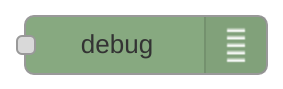

Présentation et objectifs
-------------------------

Après avoir [configuré votre Raspberry Pi](Installation_de_Raspbian "wikilink"), l'intention de cet atelier est de continuer à vous faire découvrir les possibilités de votre Raspberry Pi en utilisant [Node Red](http://nodered.org/). En plus de continuer à découvrir les possibilités de la carte, vous pourrez facilement interconnecter des objets connectés entre eux.

Node-Red permet de créer des workflows de données via une interface graphique Web. Par exemple, il est possible de demander que sur des informations venant des GPIO soient transmises à une API , un message MQTT soit transmis, un statut Twitter ... Node-Red dans sa forme la plus simple est un éditeur visuel à base de blocs que l'on "cable" entre eux. 

Qu'est-ce que cela veut dire? Cela signifie qu'il devient possible de passer plus de temps à faire "parler des choses" les unes avec les autres que de se préoccuper tout le code interfaçage. Le système contient des «nœuds» qui semblent simplement être icônes que vous faites glisser et déposer. Chaque nœud propose des fonctionnalités différentes. Par exemple, le nœud le plus simple est le noeud de débogage simple qui permet de voir ce qui se passe dans votre flux. Les nœuds "Raspberry Pi" vous permettent de lire et d' écrire les broches GPIO.


Cet outil a l'avantage d'être à la fois léger et simple à mettre en œuvre. Pour la majorité des scénarios, quasiment aucune compétence en programmation n'est nécessaire. De plus la communauté des utilisateurs développe de nombreux blocs permettant d'utiliser de plus en plus de services en ligne.

Dans la suite de ce tutoriel, nous commencerons par écrire des scénarios très simple pour comprendre les bases de l'utilisation de l'outil, puis nous terminerons par un scénario réaliste mettant en jeu plusieurs services différents. 


Pré-requis
----------
Avant de pouvoir réaliser cet atelier, il faut disposer d'un [Raspberry Pi configuré](Installation_de_Raspbian "wikilink") avec une version à jour de Raspbian.

### Matériel

Matériel nécessaire :
- Un raspberry Pi 2 ou B+
- Une breadboard
- Des fils d'interconnexion
- Des LED de couleur
- Des résistances de 220 Ohms
- Des boutons poussoirs
- Un Pi Sense Hat (Optionnel)

Pour enrichir ce tutoriel avec plusieurs capteurs, nous utiliserons une carte fille développée pour le projet [Astro Pi](https://astro-pi.org/). 

Ce "Hat" comporte plusieurs capteurs I2C :  
- Accéléromètre
- Gyromètre
- Magnétomètre
- Température
- Pression
- Humidité

En plus de ces capteurs environnementaux (utiles pour la mission spatiale pour laquelle la carte a été prévue), il y a aussi un joystick et une matrice de led RGB 8x8.


L'installation Pi Sense Hat se résume à l'activation de l'I2C dans `raspi-config` et à l'installation de deux bibliothèques Python :
```sh
sudo apt-get install sense-hat
sudo pip install pillow
sudo pip3 install pillow
``` 

Pour vérifier le bon fonctionnement de la carte, vous pouvez lancer le script suivant : 
```python
from sense_hat import SenseHat
 
sense = SenseHat()
sense.clear()
 
temp = sense.get_temperature()
print(temp)
```

Ce programme affiche simplement la température sur le terminal. Si vous voulez afficher cette information sur l'écran à LED, vous pouvez utiliser le script suivant : 

```python
from sense_hat import SenseHat
 
sense = SenseHat()
sense.clear()
 
tmax = 35
tmin = tmax - 8
 
while True:
    temp = sense.get_temperature()
    print(temp)
    temp = int(temp) - tmin
    for x in range(0, 8):
        for y in range(0, temp):
            sense.set_pixel(x, y, 255, 0, 0)
        for y in range(temp, 8):
            sense.set_pixel(x, y, 0, 0, 0) 
```

### Première étape : installation de Node-Red

Il existe deux façons de commencer avec Node-Red sur un Raspberry Pi :

- utiliser la version présente dans les dépôts de la version Jessie de Raspbian.
- installer manuellement la version présente dans le référentiel `npm`.


#### Raspbian Jessie
À partir de Novembre 2015, dans Raspbian Jessie Node-Red est préinstallé sur l'image de la carte SD qui peut être téléchargé à partir du [site officiel](https://www.raspberrypi.org/downloads/raspbian/).
Si votre version de Jessie est antérieure à cette date, il vous suffit de mettre à jour vos dépots et d'installer le paquet : 

```sh
sudo apt-get update
sudo apt-get upgrade
sudo apt-get install nodejs nodejs-legacy nodered
```

##### Lancement de Node-Red

Pour démarrer Node-Red, vous pouvez soit :

- en mode graphique, sélectionner  `Menu -> Programmation -> Node-RED`.
- en mode console, exécuter `node-red-start`.

Dans votre console vous devriez avoir un affichage similaire à ceci : 
```sh
$ node-red-start 

Start Node-RED
 
Once Node-RED has started, point a browser at http://192.168.1.91:1880
On Pi Node-RED works better with the Iceweasel browser
 
Use   node-red-stop                          to stop Node-RED
Use   node-red-start                         to start Node-RED again
Use   sudo systemctl enable nodered.service  to autostart Node-RED at every boot
Use   sudo systemctl disable nodered.service to disable autostart on boot
 
To find more nodes and example flows - go to http://flows.nodered.org
You may also need to install and upgrade npm
      sudo apt-get install npm
      sudo npm i -g npm@2.x
 
Starting Node-RED graphical event wiring tool....
Started Node-RED graphical event wiring tool..
Welcome to Node-RED
===================
1 May 18:00:22 - [info] Node-RED version: v0.13.4
1 May 18:00:22 - [info] Node.js  version: v0.10.29
1 May 18:00:22 - [info] Linux 4.1.14-v7+ arm LE
1 May 18:00:22 - [info] Loading palette nodes
pi : TTY=unknown ; PWD=/ ; USER=root ; COMMAND=/usr/bin/python -u /usr/lib/node_modules/node-red/nodes/core/hardware/nrgpio.py info
pam_unix(sudo:session): session opened for user root by (uid=0)
pam_unix(sudo:session): session closed for user root
1 May 18:00:30 - [info] Settings file  : /home/pi/.node-red/settings.js
1 May 18:00:30 - [info] User directory : /home/pi/.node-red
1 May 18:00:30 - [info] Flows file : /home/pi/.node-red/flows_labpione.json
1 May 18:00:30 - [info] Creating new flow file
1 May 18:00:30 - [info] Starting flows
1 May 18:00:30 - [info] Started flows
1 May 18:00:30 - [info] Server now running at http://127.0.0.1:1880/

```
La lecture de ce journal vous permet de connaître le port sur lequel est lancé votre serveur Node-Red. Dans l'exemple c'est le port 1880 qui est utilisé.


Pour arrêter votre instance Node-Red, il faudra exécuter la commande `node-red-stop`.

##### Lancement automatique à chaque démarrage
Si vous utilisez Node-Red dans un système personnel qui doit se faire oublier, l'idéal est de lancer automatiquement votre instance de 
Node-Red au démarrage du Raspberry Pi. Pour se faire, il suffit de lancer la commande suivante : 
```sh
sudo systemctl enable nodered.service 
```

##### Ajout de nouveaux noeuds

Pour ajouter des nouveaux noeuds dans votre installation Node-Red, le plus simple est d'utiliser l'outil d'installation de `node.js` appelé `npm`.
Les commandes suivantes installe cet outil et le configure pour utiliser la branche _2.x_.
```sh
sudo apt-get install npm
sudo npm install -g npm@2.x
cd ~/.node-red

```

Les différents blocs développé par la communauté est visible sur la page : [http://flows.nodered.org](http://flows.nodered.org). Pour installer l'un d'eux, 
il suffit de noter le nom du bloc et de l'installer avec les commandes suivantes :
```sh
cd ~/.node-red
npm install node-red-{example node name}
```
Une fois le bloc installé, il faut redémarrer le serveur Node-Red avec les commandes suivantes :
```sh
node-red-stop
node-red-start
```
#### Installation manuelle
Si vous souhaitez utiliser une autre version de `node.js` que celle présente dans les dépôts officiels de Raspbian Jessie, vous devrez installer manuellement Node-Red.
Cette procédure est bien plus complexe que la précédente et dépasse le cadre de ce tutoriel. La documentation officielle donne [la marche à suivre complète](http://nodered.org/docs/hardware/raspberrypi#manual-install).


### Deuxième étape : découverte de Node-Red

Une fois votre instance Node-Red en cours d' exécution, ouvrez un navigateur sur l'adresse suivante : 
http://{nom de votre Rasperry pi}.local:1880

Si tout se passe bien, vous devriez avoir l'affichage suivant : 


#### Ajouter un nœud Inject

Le nœud *Inject*, comme son nom l'indique, permet d'injecter des messages dans un flux, soit en cliquant sur le bouton sur le nœud, ou en fixant un intervalle de temps entre deux injections. Ce noeud produit des données, il est donc considéré comme une entrée. Il sera utilisé comme point d'entré d'un flot.


Pour l'utiliser dans le flot courant, faites glisser ce nœud sur l'espace de travail à partir de la palette à gauche. Ouvrir la barre latérale (Ctrl-Space, ou via le menu déroulant) et sélectionnez l'onglet Infos. Sélectionnez le nœud Inject nouvellement ajouté pour afficher des informations sur ses propriétés et une description de ce qu'il fait.


#### Ajouter un nœud Debug

Le nœud de débogage affiche dans la barre latérale de débogage les messages reçu à partir de son entrée. Par défaut, il affiche simplement la charge utile du message, mais il est possible d'afficher l'objet du message entier. Il consomme des données provenant d'autres noeuds, il est donc dans la catégorie des sorties.



Faites glisser ce nœud sur votre espace de travail pour l'ajouter. Comme pour le précédent, vous pouvez faire apparaître la fenêtre d'information pour avoir accès à la documentation du nœud.

#### Connecter les deux ensemble

Branchez les noeuds *Inject* et *Debug* ensemble en faisant glisser la souris entre le port de sortie premier et le port d'entrée du second.


#### Déployer

À ce stade, les nœuds existent uniquement dans l'éditeur et doivent être déployés sur le serveur. Cliquez simplement sur le bouton *Deploy* pour enregistrer votre flot courant et le lancer sur votre instance Node-Red. 

Sélectionnez l'onglet *Debug* de la barre latérale droite et cliquez sur le bouton Inject. Vous devriez voir les nombres apparaître dans la barre latérale. Par défaut, le nœud *Inject* retourne le nombre de millisecondes depuis le 1er Janvier, 1970 comme charge utile.


#### Ajouter un noeud de fonction

Le nœud de fonction permet de passer chaque message reçu à une fonction JavaScript. Ces nœuds sont extrêmement utiles pour transformer un message reçu et l'injecter dans d'autres noeuds.


Câblez le nœud de fonction entre les nœuds Inject et Debug. Vous devrez peut-être supprimer le fil existant (sélectionner et appuyez sur Suppr sur le clavier). 


Double-cliquez sur le nœud de fonction pour faire apparaître la boîte de dialogue d'édition. 


Copiez le code de suivi dans le domaine de la fonction:
```javascript
//Création d'un objet Date à partir de la charge utile 
var date = new Date(msg.payload);
//Transformation de la charge utile en une chaîne formatée 
msg.payload = date.toString();
// Retourne le message
return msg;
```
Cliquez sur OK pour fermer la boîte de dialogue d'édition, puis cliquez sur le bouton de déploiement. Maintenant, lorsque vous cliquez sur le bouton *Inject*, 
les messages dans la barre latérale seront horodatage plus lisibles.


#### La source

Avec Node-Red, un flot n'est rien d'autre qu'un document *JSON*. Le flot créé dans cet exemple peut être exporté pour pouvoir être plus facilement partageable : 
```javascript
[
  {
    "id":"7bc70730.e857d8",
    "type":"inject",
    "z":"ed61f83c.a99068",
    "name":"Injection",
    "topic":"",
    "payload":"",
    "payloadType":"date",
    "repeat":"",
    "crontab":"",
    "once":false,
     "x":162,
     "y":387,
     "wires":[["583534eb.c00b0c"]]
  },
  {
    "id":"7b9ad8e3.9eb048",
    "type":"debug",
    "z":"ed61f83c.a99068",
    "name":"Debug",
    "active":true,
    "console":"false",
    "complete":"payload",
    "x":357,
    "y":385,
    "wires":[]
  },
  {
    "id":"583534eb.c00b0c",
    "type":"function",
    "z":"ed61f83c.a99068",
    "name":"Function",
    "func":"//Création d'un objet Date à partir de la charge utile \nvar date = new Date(msg.payload);\n//Transformation de la charge utile en une chaîne formatée \nmsg.payload = date.toString();\n// Retourne le message\nreturn msg;",
    "outputs":1,
    "noerr":0,
    "x":277,
    "y":505,
    "wires":[["7b9ad8e3.9eb048"]]
  }
]
```
Ce document peut être importé directement dans l'éditeur en copiant/collant le json dans la boîte de dialogue d'importation (Ctrl-I ou via le menu déroulant).


